# Basic Connectivity Lab

## Objective

This lab focuses on reinforcing basic knowledge on how two PCs can locally connect to one another through a switch.

- **Tools Used**:
  - [Cisco Packet Tracer](https://www.netacad.com/cisco-packet-tracer)

---

## Steps and Key Findings

### 1. Drag two PCs and one switch onto the screen
- **Process**: Look for the icons on the bottom left of Cisco Packet Tracer for the appropriate devices.
- **Observation**: It is not exactly clear where these devices are. For the convenience of showcasing this lab, I will show it below with the following screenshots.

  

    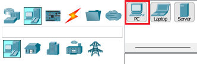
     
    <em>Figure 1: Showing where the PC button is.</em>
  

  

    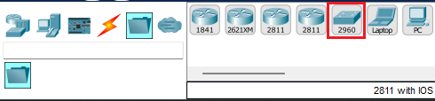
     
    <em>Figure 2: Showing where the switch button is. It is labelled "2960" because it is modeled after the Cisco Catalyst 2960, which is a real enterprise-grade switch after some research.</em>
  

  

    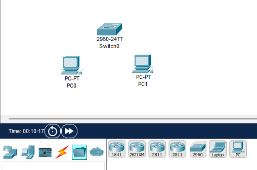
     
    <em>Figure 3: The devices placed into the workspace.</em>
  

### 2. Connecting the devices together
- **Process**: Utilize a copper straight through cable to connect the PCs to the switch.
- **Observation**: We use a copper straight-through cable to ensure that the transmit and receive pins align correctly between devices.. In more specific terms, we want the Tx (transmit) pins from the PC to connect to the Rx (receive) pins on the switch, and vice versa, to enable successful two-way communication.

  

    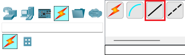
     
    <em>Figure 4: Highlighting the copper straight through cable in Cisco Packet Tracer.</em>
  

  

    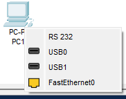
     
    <em>Figure 5: Menu that shows up when you left click the PC to apply the cable. We use "FastEthernet0" in this instance.</em>
  

  

    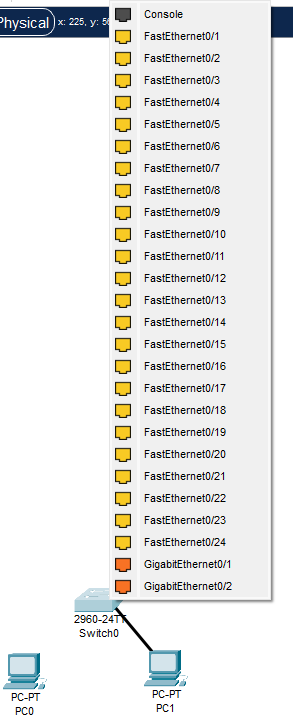
     
    <em>Figure 6: Upon clicking the switch after connecting the cable to the PC, we are greeted with this long list of ports. It shouldn't matter which we use, but I used the first option directly under "Console". We do the same exact thing in Figures 5 and 6 for the other PC.</em>
  

  

    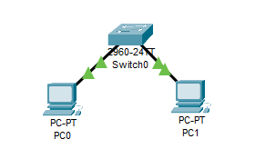
     
    <em>Figure 7: This is what the result should be after connecting the PCs to the switch. It might not look like this right away after connecting the devices, but don't pay too much mind to the icons. Eventually, it will all be green triangles.</em>
  

### 3. Configuring the PCs
- **Process**: Assign an IP address to both PCs. In this case, we will be assigning the address `192.168.1.10` to `PC0` and `192.168.1.11` to `PC1`.
- **Observation**: To do this, we need to left click each PC and configure the IP settings. Steps will be shown below.

  

    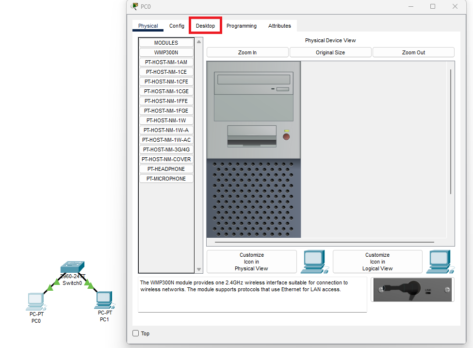
     
    <em>Figure 8: Here, we left click PC0 to open up a window. In this window, we must navigate to the Desktop tab, highlighted by the red box.</em>
  

  

    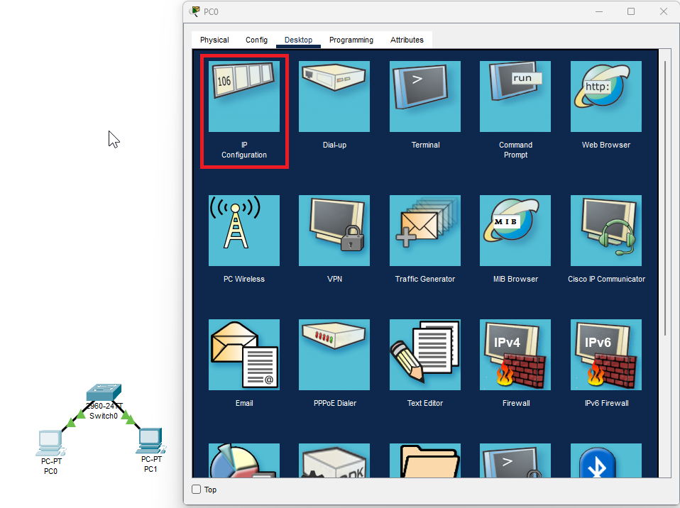
     
    <em>Figure 9: In this interface, click the IP Configuration icon as shown.</em>
  

  

    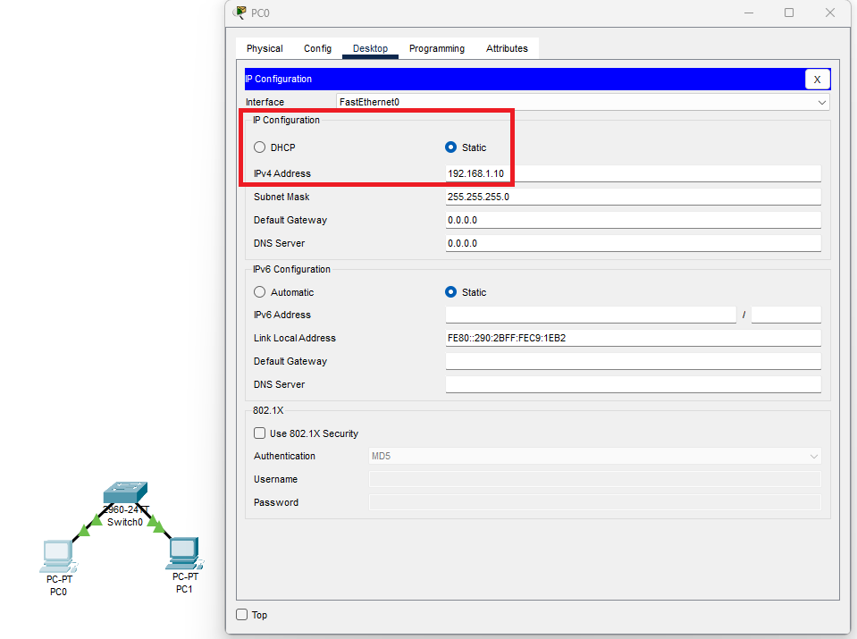
     
    <em>Figure 10: Where it says "IPv4 Address", we must input our desired IP address to assign to the device. In this case, PC0 will get the address "192.168.1.10". Repeat the steps shown in Figures 8, 9, and 10 for PC1, except assign PC1 the address "192.168.1.11".</em>
  

### 4. Test the connection
- **Process**: From either PC, ping the other by utilizing the `ping` command.
- **Observation**: We can tell that the connection is successful if the packets go through. To open up the command prompt on either PC, navigate to the command prompt icon, shown in Figure 9 as the fourth icon on the first row.

  

    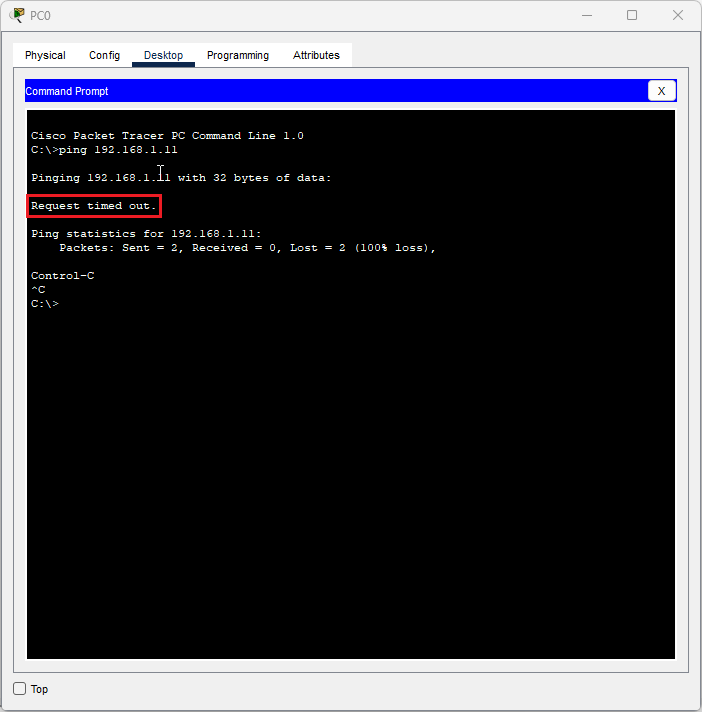
     
    <em>Figure 11: This is what happens if the PCs are not configured correctly. Because, in this case, PC0 cannot find PC1, the request will time out as the packets don't know where to go.</em>
  

  

    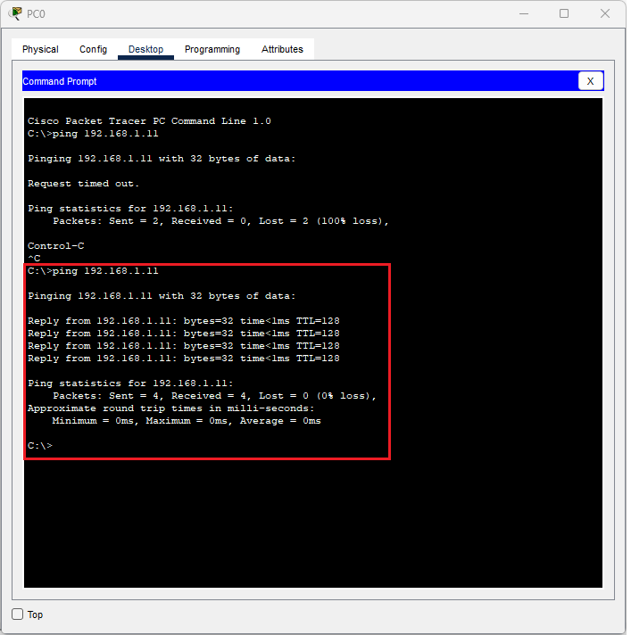
     
    <em>Figure 12: As shown with the red box, this is what happens if the PCs are configured correctly. Packets are sent successfully, and the other PC is able to send a reply back, showcasing a successful connection and configuration.</em>
  

---

## Key Takeaways

- **Fundamentals of Network Communication**: This lab reinforced the core principle that devices like PCs must be properly connected and configured to communicate over a network. Understanding how to assign IP addresses and verify connectivity through ping tests is foundational to network troubleshooting.
- **Device Connection Standards**: I learned that when connecting end devices (PCs) to intermediary devices (switches), we use copper straight-through cables. This is because straight-through cables ensure the transmit (Tx) pins of one device align with the receive (Rx) pins of the other, enabling successful two-way communication.
- **Switch Identification and Real-World Relevance**: The switch in Packet Tracer is labeled as "2960", which refers to Cisco’s Catalyst 2960 series — real-world enterprise-grade hardware. Recognizing this helped me bridge the gap between simulation and actual industry equipment.
- **Hands-On Practice with Packet Tracer**: This was my first time in a while using Cisco Packet Tracer, and I reviewed how to navigate its interface, locate devices, connect them correctly, and use tools like the command prompt and IP configuration menus. This hands-on experience has improved my comfort with the software.
- **Troubleshooting Visual Indicators**: I observed that the connection icons may not immediately turn green when devices are connected. Understanding this delay and trusting the configuration process helped me avoid second-guessing and troubleshoot only when needed.
- **Incremental Learning is Valuable**: Even simple labs like this one can teach valuable lessons. By documenting each step and reflecting on the reasons behind every action, I’ve gained a deeper appreciation for networking fundamentals that often get taken for granted.
