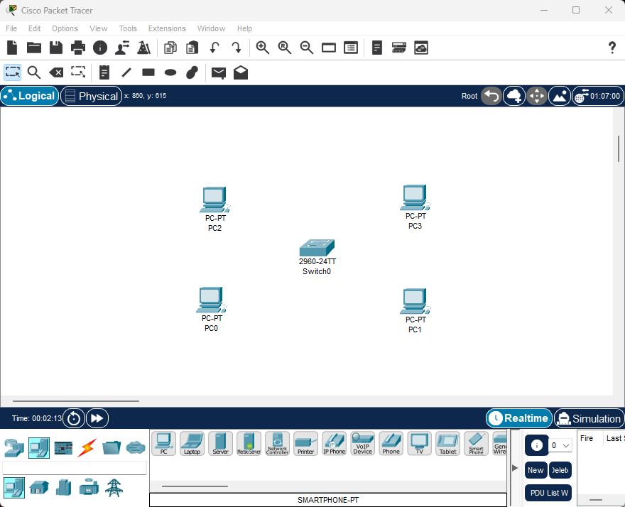
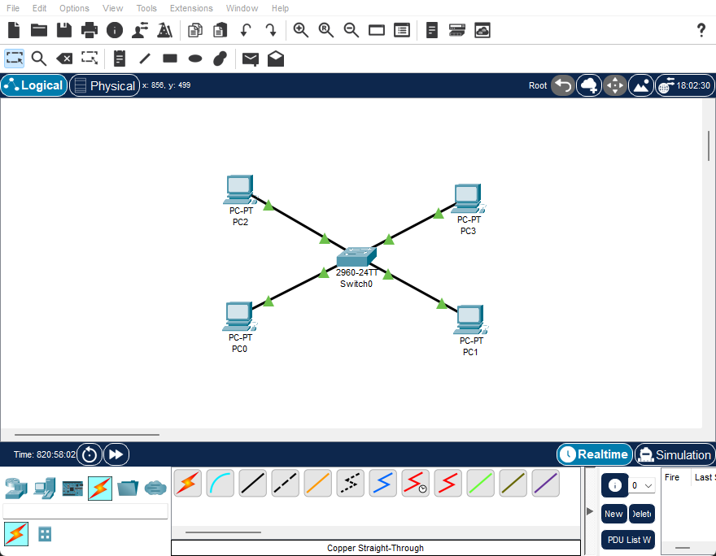
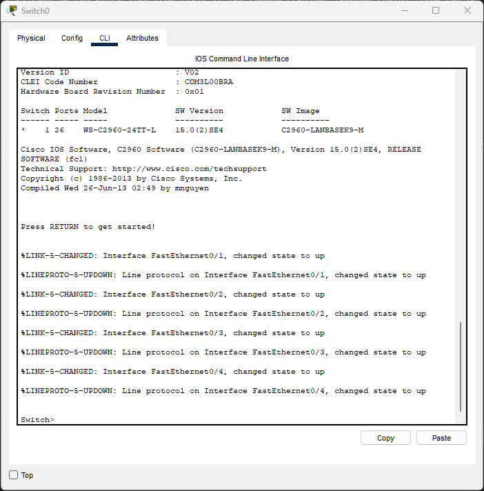
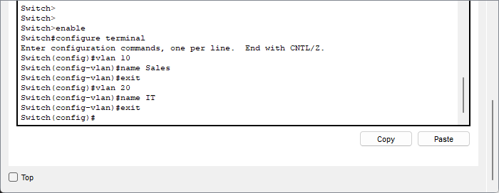
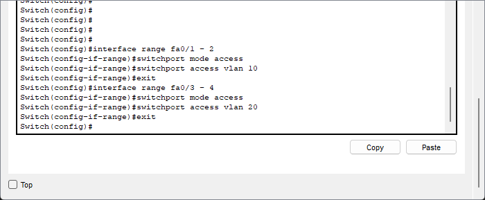
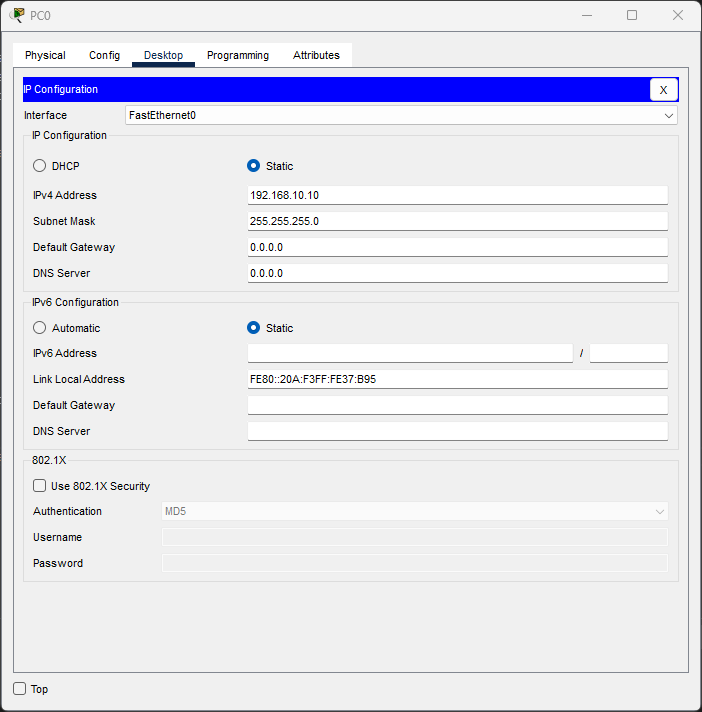
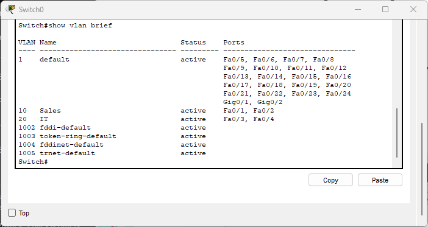
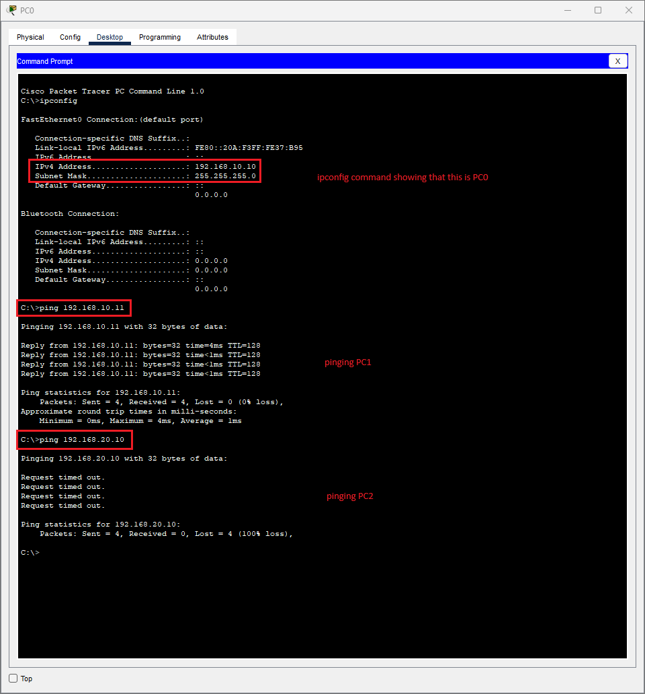

# VLAN Configuration Lab

## Objective

This lab demonstrates how to create and assign VLANs on a Cisco switch to logically segment a network. We will use Cisco Packet Tracer to configure VLAN 10 and VLAN 20 and assign ports to them accordingly.

- **Tools Used**:
  - [Cisco Packet Tracer](https://www.netacad.com/cisco-packet-tracer)

---

## Steps and Key Findings

### 1. Prepare the Workspace
- **Process**: Drag one switch and four PCs onto the workspace.
- **Observation**: We'll assign two PCs to VLAN 10 and two PCs to VLAN 20. The switch is where VLANs will be created and assigned to specific ports.

  <p align="center">
    
    <br/>
    <em>Figure 1: Preparing the workspace. We dragged the appropriate icons, being four PCs and one switch, onto the sandbox.</em>
  </p>

### 2. Connect the Devices

- **Process**: Use copper straight-through cables to connect the PCs to the switch. I clicked on the black line icon (this is the copper straight-through cable), then the PC, and then the switch whilst following the yellow ethernet icons in the menus that pop up.
- **Explanation**: Straight-through cables are used to connect end devices (PCs) to intermediary devices (switches).
  - PC0 to Fa0/1
  - PC1 to Fa0/2
  - PC2 to Fa0/3
  - PC3 to Fa0/4

  <p align="center">
    
    <br/>
    <em>Figure 2: Connecting the PCs to the switch using copper straight-through cables. The icons near the switch will not be a green triangle at first; that is because it takes time for the devices to communicate with one another to establish the connection fully.</em>
  </p> 

### 3. Access the Switch CLI

- **Process**: Click the switch > CLI tab > press Enter.
- **Observation**: This opens the command line interface to configure the switch.

  <p align="center">
    
    <br/>
    <em>Figure 3: The command line of the switch.</em>
  </p>

### 4. Create VLANs

- **Process**: The following commands were used to configure VLANs in the switch appropriately.
- **Observation**: This allows us to put the devices into their own network, even though all devices are on the same switch.

```bash
Switch> enable                  # Enter privileged EXEC mode
Switch# configure terminal      # Enter global configuration mode

# Create VLAN 10 and name it Sales
Switch(config)# vlan 10
Switch(config-vlan)# name Sales
Switch(config-vlan)# exit       # Back to global config mode

# Create VLAN 20 and name it IT
Switch(config)# vlan 20
Switch(config-vlan)# name IT
Switch(config-vlan)# exit       # Back to global config mode
```

- **Explanation**:
  - `enable`: Enter privileged EXEC mode.
  - `configure terminal`: Enter global configuration mode.
  - `vlan 10`: Create VLAN 10.
  - `name Sales`: Label VLAN 10 as "Sales".
  - `vlan 20`: Create VLAN 20.
  - `name IT`: Label VLAN 20 as "IT".
  - `exit`: Each `exit` moves you back one level in the command hierarchy.

- **Observation**: Another thing to note is that, upon doing some further research, the VLAN IDs are in multiples of 10 for conventional purposes. VLANs 1-9 are usually reserved for special cases, whereas everything after that is fair game. Organization is key!

  <p align="center">
    
    <br/>
    <em>Figure 4: Creating two VLANs, VLAN 10 being "Sales", and VLAN 20 being "IT".</em>
  </p>


### 5. Assign Ports to VLANs

- **Process**: The following commands were used to assign the available ports into the appropriate VLANs.
- **Observation**: Assigning the ports will connect any device in those ports to the assigned VLAN.

#### Assign PC0 and PC1 to VLAN 10

```bash
Switch(config)# interface range fa0/1 - 2
Switch(config-if-range)# switchport mode access
Switch(config-if-range)# switchport access vlan 10
Switch(config-if-range)# exit
```

#### Assign PC2 and PC3 to VLAN 20

```bash
Switch(config)# interface range fa0/3 - 4
Switch(config-if-range)# switchport mode access
Switch(config-if-range)# switchport access vlan 20
Switch(config-if-range)# exit
```

- **Explanation**:
  - `interface range`: Selects multiple ports at once.
  - `switchport mode access`: Ensures the ports operate in access mode.
  - `switchport access vlan X`: Assigns the ports to the specified VLAN.
  - `exit`: Returns to global configuration mode from interface configuration.

  <p align="center">
    
    <br/>
    <em>Figure 5: Assigning the first two ports (denoted as "1 - 2") to VLAN 10, and the last two ports (denoted as "3 - 4") to VLAN 20.</em>
  </p>

### 6. Assign IP Addresses to PCs

- **Process**: Click on each PC > Desktop tab > IP Configuration > Assign IP address and subnet mask.
    - PC0: `192.168.10.10`, subnet mask `255.255.255.0`
    - PC1: `192.168.10.11`, subnet mask `255.255.255.0`
    - PC2: `192.168.20.10`, subnet mask `255.255.255.0`
    - PC3: `192.168.20.11`, subnet mask `255.255.255.0`

- **Observation**: Notice that the third octet denotes the VLAN that the device is a part of. Also, we must keep the IP address as static to be able to assign the IP addresses accordingly.

  <p align="center">
    
    <br/>
    <em>Figure 6: Configuring PC0 with the appropriate IP address and subnet mask. The same has been done for the other 3 devices connected to the switch.</em>
  </p>

### 7. Verify VLAN Configuration

- **Process**: Utilize the following command to show a list of current VLANs in the switch.

```bash
Switch# show vlan brief
```

- **Observation**: Confirms which ports belong to which VLANs. We see Fa0/1 and Fa0/2 under VLAN 10 (Sales), and Fa0/3 and Fa0/4 under VLAN 20 (IT).

  <p align="center">
    
    <br/>
    <em>Figure 7: Output of <code>show vlan brief</code>. We can see the two VLANs, VLAN 10 (Sales) and VLAN 20 (IT), in this list.</em>
  </p>

### 8. Test Connectivity

- **Process**: Use the ping command from PC0 to PC1 (should succeed) and from PC0 to PC2 (should fail).
- **Explanation**: Devices in the same VLAN can communicate. Devices in different VLANs cannot, unless configured with a router or Layer 3 switch.

  <p align="center">
    
    <br/>
    <em>Figure 8: Testing the VLANs from PC0. PC0 -> PC1 shows a response, but PC0 -> PC2 does not, which makes sense as PC2 is on VLAN 20 rather than VLAN 10.</em>
  </p>

  ---

## Key Takeaways

- **VLAN Fundamentals**: VLANs allow segmentation of a network within the same switch, improving organization, security, and performance.
- **Hands-On VLAN Creation**: Learned how to create VLANs and assign names for clarity using `vlan` and `name` commands.
- **Port Assignment**: Configuring specific ports with `switchport mode access` and `switchport access vlan X` makes the VLANs functional.
- **Command Hierarchy Awareness**: Understanding how to navigate between modes like `(config-if-range)` back to `(config)` using `exit` is crucial for switch configuration.
- **Logical Separation**: Even though all devices are connected to the same switch, VLANs enforce communication boundaries without needing separate hardware.
- **Verification and Testing**: The `show vlan brief` command and ping tests ensure that VLANs are functioning as expected.

---