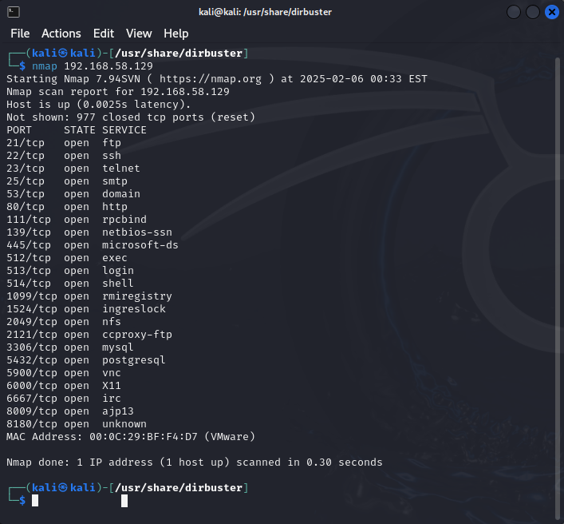
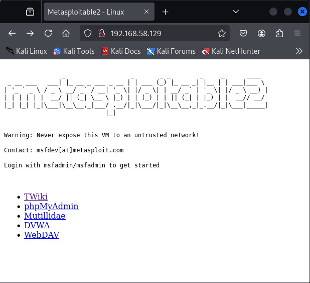
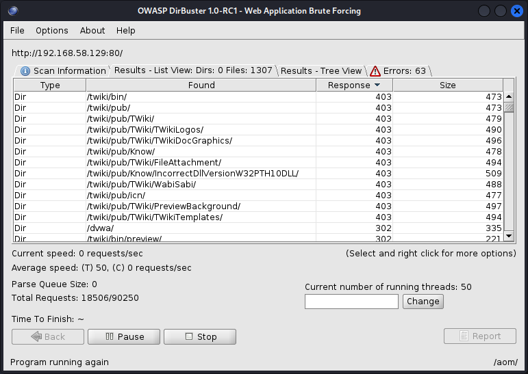
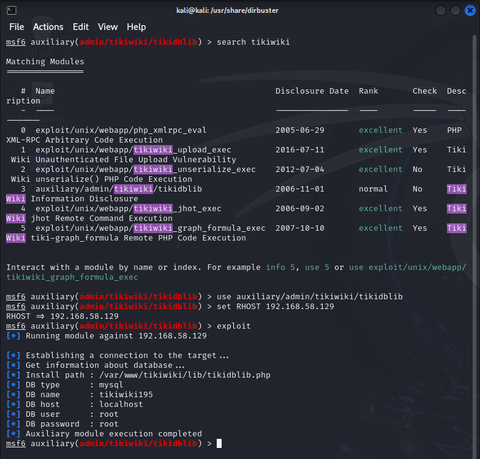
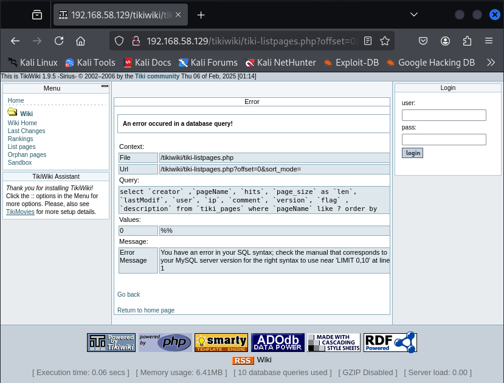

# Metasploitable Lab

## Objective

This lab focuses on exploring vulnerabilities in the Metasploitable and TikiWiki systems, utilizing tools such as Nmap, Firefox, and Metasploit to identify, exploit, and document security flaws.

---

## Environment Setup

- **Target IP**: `192.168.58.129` *(Note: This IP was updated due to technical issues and lab restarts)*
- **Tools Used**:
  - Nmap
  - Firefox
  - Metasploit (msfconsole)
  - DirBuster

---

## Steps and Key Findings

### 1. Nmap Scan
- **Observation**: Detected open port `80/tcp` indicating HTTP is active.
  

### 2. Testing HTTP Access with Firefox
- **Observation**: Accessed Metasploitable through Firefox using the target IP.
  

### 3. Discovering TikiWiki with DirBuster
- **Observation**: TikiWiki was discovered during directory brute-forcing.
  

### 4. Exploitation with Metasploit
- **Process**: 
  - Configured and executed `msfconsole` for exploitation.
  - Navigated to `/tiki-listpages.php` using a supplied link (192.168.58.129/tikiwiki/tiki-listpages.php?offset=0&sort_mode=).
  
  

### 5. Shell Access *(Incomplete)*
- **Intended Process**:
  - Upload and execute a PHP reverse shell script (`shell.php`) to establish shell access.
- **Status**:  
  - This step could not be completed because the reverse shell file was unavailable.

### 6. SSH Key Exploitation *(Incomplete)*
- **Intended Process**:
  - Extract the public key from `/root/.ssh/authorized_keys`.
  - Use the precomputed Debian OpenSSL RSA key archive (downloaded from milw0rm) to match the public key with a corresponding private key and gain SSH access.
- **Status**:
  - The RSA key archive from `milw0rm.com` is no longer available, preventing completion of this step.

---

## Key Takeaways

- The lab demonstrated the use of various tools to identify vulnerabilities, such as directory brute-forcing and payload injection.
- **Reverse Shell and SSH Exploitation**:  
  - The intended reverse shell was not available, which limited interactive access.
  - Similarly, the unavailability of the RSA key archive (originally hosted on milw0rm) prevented completion of the SSH key exploitation step.
- These issues highlight the challenges of relying on external resources in lab environments and underscore the importance of maintaining alternative sources or local caches.
- Despite these setbacks, the documented steps up to exploitation provided valuable insights into penetration testing techniques and the exploitation process.

---

## Additional Notes

- Not every command was captured in a screenshot, but the key steps have been documented.
- This lab was recreated from the original assignment included in this directory.
- **Unavailable Resources**:
  - The PHP reverse shell file and the Debian OpenSSL RSA key archive (milw0rm link) could not be retrieved.
  - In 2019, I was able to complete these steps likely due to access to a local or cached version of these files provided by the institution.
  - Their current unavailability has prevented full completion of Steps 5 and 6.
