# Metasploitable Lab

## Objective

This lab focuses on exploring vulnerabilities in the Metasploitable and TikiWiki systems, utilizing tools such as Nmap, Firefox, and Metasploit to identify, exploit, and document security flaws.

---

## Environment Setup and Tools/Resources Used

- **Target IP**: `192.168.58.129` (IP address of the Metasploitable VM)
  - Eventually changes to `192.168.58.130` due to updates/technical difficulties, from Figure 6 onwards.
- **Tools Used**:
  - Nmap
  - Firefox
  - Metasploit (msfconsole)
  - DirBuster
  - Kali Linux
- **Resources Used**:
  - [Reverse Shell Code](https://pentestmonkey.net/tools/web-shells/php-reverse-shell)
  - https://gitlab.com/exploit-database/exploitdb-bin-sploits/-/raw/main/bin-sploits/5622.tar.bz2 (for `wget` command later in the lab, this is the RSA key archive)
  - [Metasploitable2 VM](https://sourceforge.net/projects/metasploitable/files/Metasploitable2/)
---

## Steps and Key Findings

### 1. Nmap Scan
- **Process**: Perform an Nmap scan on the target IP, in this case it is `192.168.58.129`.
- **Observation**: Detected open port `80/tcp` indicating HTTP is active.

  

    
     
    <em>Figure 1: Nmap scan showing all open ports.</em>
  

### 2. Testing HTTP Access with Firefox
- **Process**: See if Metasploitable was accessible via web browser, with the tool used in this case being Firefox.
- **Observation**: Accessed Metasploitable through Firefox using the target IP.

  

    
     
    <em>Figure 2: Successfully accessing Metasploitable in Firefox.</em>
  

### 3. Discovering TikiWiki with DirBuster
- **Process**: Utilize DirBuster to find anything interesting.
- **Observation**: TikiWiki was discovered during directory brute-forcing.

  

    
     
    <em>Figure 3: DirBuster at work, showing many directories under TikiWiki that may be accessible.</em>
  

### 4. Exploitation with Metasploit
- **Process**: 
  - Configured and executed `msfconsole` for exploitation.
  - Navigated to `/tiki-listpages.php` using a supplied link, which is the following: `192.168.58.129/tikiwiki/tiki-listpages.php?offset=0&sort_mode=`.
- **Observation**: A connection was able to be established to the target host. Upon using the supplied link in the lab instructions, we arrive at an interesting page, though I am unsure as to what the purpose of the lab instruction was.

  

    
     
    <em>Figure 4: Attacking the target machine with an exploit. We find some handy credentials as a result.</em>
  

  

    
     
    <em>Figure 5: Utilizing a supplied link, we arrive at an interesting page. </em>
  

  

    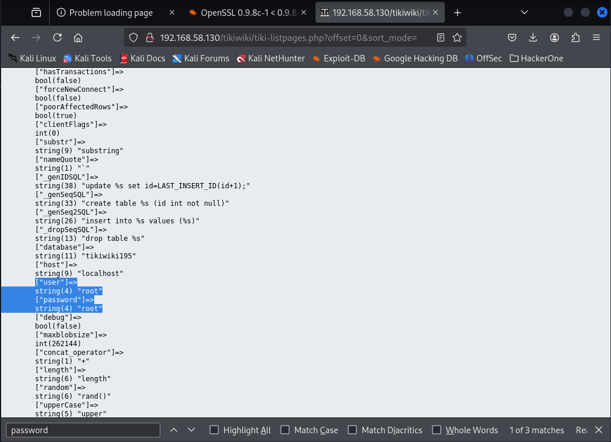
     
    <em>Figure 6: Upon scrolling down though, we can see some interesting credentials. Seems familiar from the exploit we ran in Figure 4. Note that this is where the IP address changes from 192.168.58.129 to 192.168.58.130 for this lab report.</em>
  

### 5. Access MySQL Database on Metasploitable2
  - **Process**: Utilizing the credentials found in the previous section, access the MySQL database to try and find some useful information.
  - **Observation**: We were able to find an even more useful set of credentials by sifting through the database.

  

    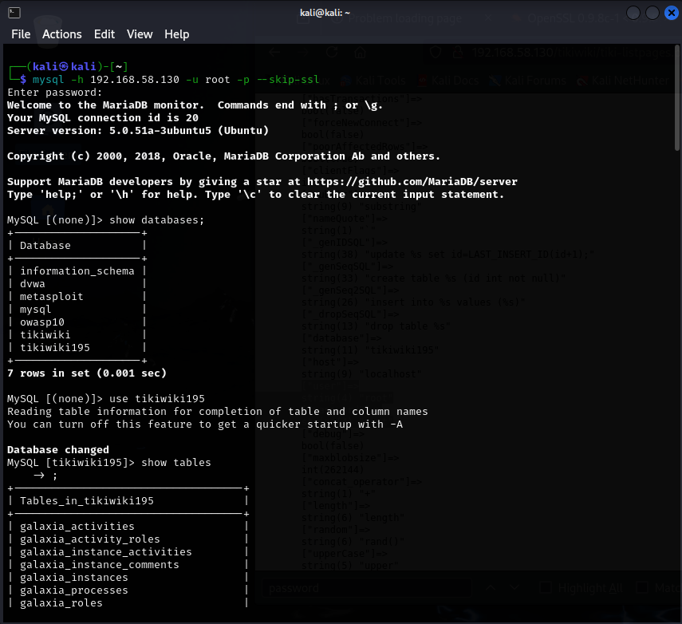
     
    <em>Figure 7: Utilizing the credentials we found in the previous section (Username: root, Password: root), we can now search through this database for anything useful.</em>
  

  

    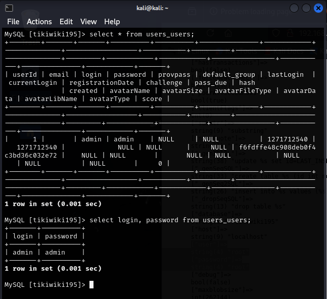
     
    <em>Figure 8: As it turns out, we do indeed find something pretty enticing. This is the admin account for TikiWiki.</em>
  

### 5. Shell Access into TikiWiki
- **Process**:
  - Upload and execute a PHP reverse shell script (`reverseshell.php`) to establish shell access.
    - We do this by using the credentials we found in Figure 8 to log into TikiWiki.
- **Observation**: The reverse shell worked like a charm, and we were able to get shell access to Metasploitable2. Figure 11 shows and explains this.

  

    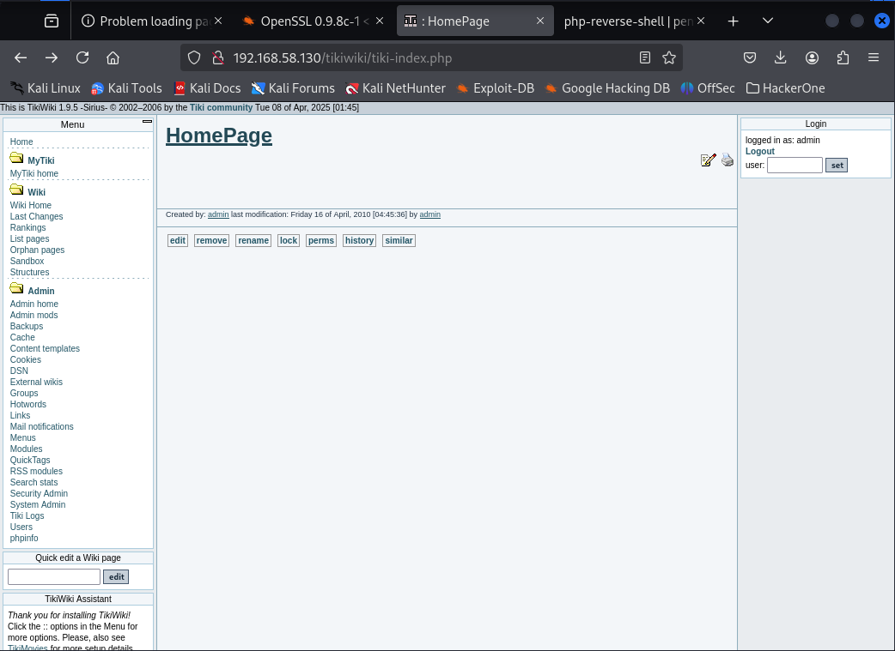
     
    <em>Figure 9: Logged into TikiWiki under the admin account. I didn't show this here, but it did ask for a password change upon logging in.</em>
  

  

    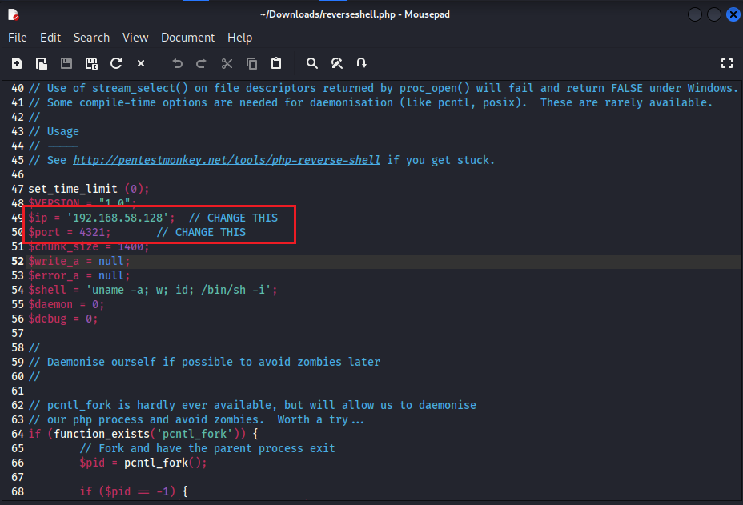
     
    <em>Figure 10: Note the red box. $ip is where our IP address goes, and the port we listen on can be anything as long as it is not currently in use. Port 4321 in this case is nice, sweet, and simple.</em>
  

- **Observation**: After configuring the `reverseshell.php` file correctly, we need a place to upload this file so we can execute it. Luckily, TikiWiki has a page called `backups` that we can use to our advantage. As Figure 11 shows, we execute this reverse shell by utilizing the following URL: `<our IP Address>/tikiwiki/backups/reverseshell.php` (if you are following along and happen to name the shell file as something else, replace `reverseshell` with whatever you named the file).

  

    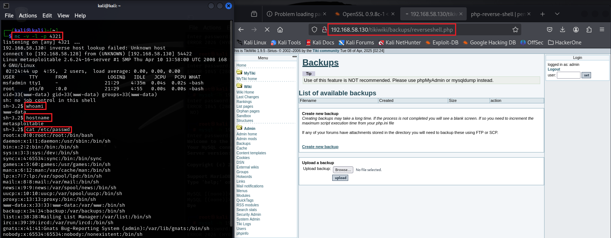
     
    <em>Figure 11: Executing the reverse shell after uploading it into the backups section of TikiWiki. The command line you see on the left shows that we are indeed under the name "metasploitable".</em>
  

### 5.5 Exploit Metasploitable using Metasploit to gain shell access
- ***Note***: You may skip this section of the lab if you are not interested in the hiccup I ran into whilst performing this lab. This section serves as a way to shed some light on a problem I ran into that I was unable to find a solution for.
- **Intended Process**: Utilize Metasploit to gain shell access to Metasploitable2.
- **Observation**: We were unable to execute the following exploits and payloads properly. Unsure if this is because this version of Metasploit patched something or not (This version of Kali Linux uses `msf6`, and the version that I used in the past when I perfomed this lab the first time used `msf5`).

  

    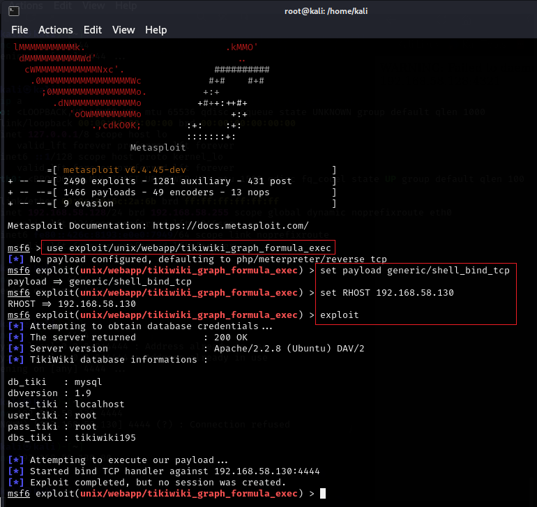
     
    <em>Figure 12: Following the original set of commands in the lab instructions, I was met with "Exploit completed, but no session was created". Unsure as to why this happened. So, what's the workaround?</em>
  

### 6. SSH Key Exploitation for Root access
- **Process**:
  - Deviate from the original set of lab instructions temporarily to achieve the same results.
    - Use the reverse shell that we uploaded in Section 4.
  - Extract the public key from `/root/.ssh/authorized_keys`.
  - Using this public key, we need to then find the appropriate identity file.
  - Using the appropriate identity file, gain root access to Metasploitable2

  

    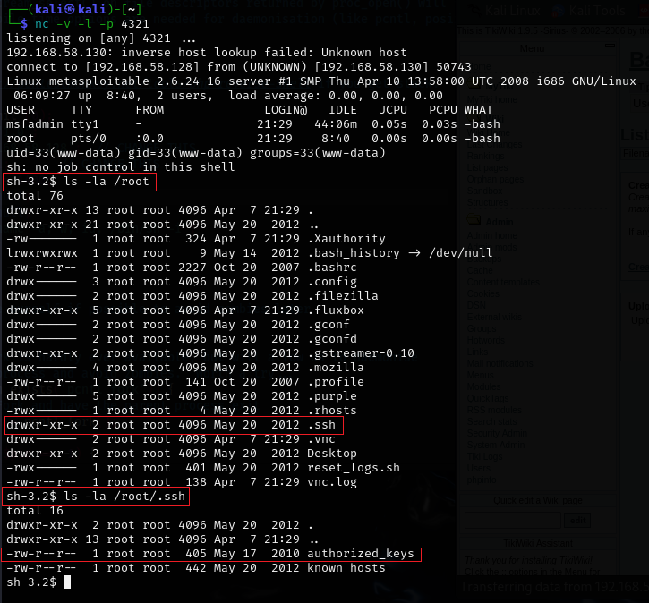
     
    <em>Figure 13: Running the reverse shell on port 4321 again, we need to find the authorized keys for SSH (Secure Shell) access. We manage to find it here.</em>
  

  

    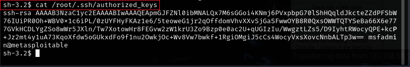
     
    <em>Figure 14: Showing the contents of this file, we can see that this is an RSA public key that's authorized, with some credentials associated with this authorized key being msfadmin@metasploitable.</em>
  

- ***Friendly Reminder***: We downloaded an RSA key archive for Figure 15. Please refer to that and obtain it via the `wget` command in the virtual machine that you are performing this lab.

  

    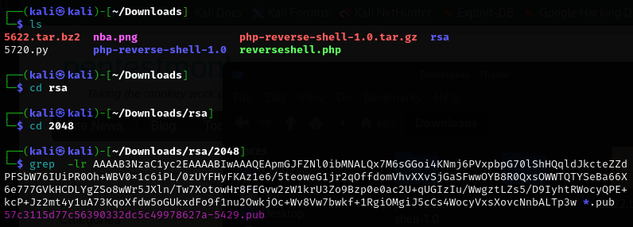
     
    <em>Figure 15: Finding the file that contains the public key that we found in Figure 14.</em>
  

  

    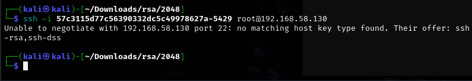
     
    <em>Figure 16: The original command that was executed in both the lab instructions and my old lab report didn't work this time around. What gives?</em>
  

- **Observation**: After much research and digging through online forums, it was concluded that it was a modern OpenSSH compatibility issue. Logically, this must have happened over the years as Kali Linux kept getting updated to keep up with the latest exploits and to account for vulnerabilities that were found over time. As a result, and with Metasploitable2 being a literal dinosaur by comparison, stuff becomes incompatible. Luckily, we have a workaround to play with.

  

    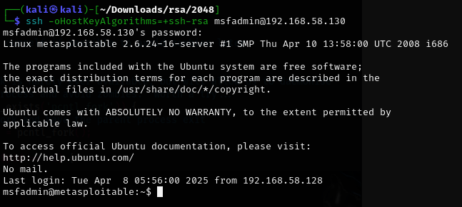
     
    <em>Figure 17: Further research among many online forums landed me with this result. What's interesting here is that I didn't specify an RSA public key to be used for the SSH connection. Normally this would probably be enough to start causing some chaos, but what if we wanted even more control?</em>
  

  

    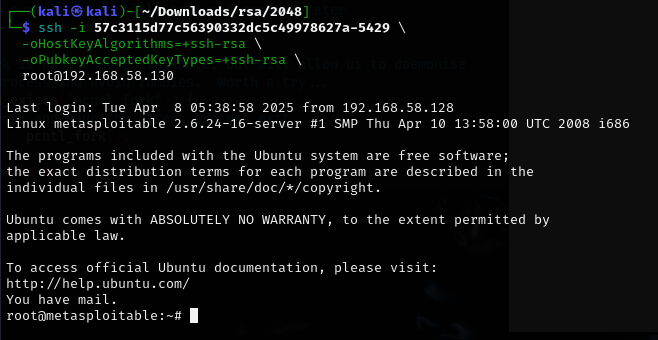
     
    <em>Figure 18: Even more further research among many online forums landed me with this result. The additional parameters in green essentially tell SSH to make an exception for RSA keys in order to establish a successful connection, only this time with the root account.</em>
  

---

## Key Takeaways

- The lab demonstrated the use of various tools to identify vulnerabilities, such as directory brute-forcing and payload injection.
- **Comprehensive Vulnerability Identification**: The lab demonstrated the power of various tools (Nmap, DirBuster, Metasploit) in identifying and exploiting vulnerabilities in the Metasploitable2 and TikiWiki systems. Specifically, directory brute-forcing was crucial in revealing hidden resources, and payload injection was effective for exploiting vulnerable web applications.
- **Reverse Shell Execution**: Uploading and executing a PHP reverse shell via TikiWiki’s backup directory was a pivotal step in gaining shell access. This step emphasized the importance of exploiting misconfigurations or overlooked features within web applications to achieve remote access.
- **Real-World Troubleshooting**: Encountering challenges with Metasploit's latest version (msf6) highlighted the real-world complexities of working with legacy systems. The process of troubleshooting and finding alternative solutions (such as using an already uploaded reverse shell) mirrored the persistent and adaptive mindset needed in cybersecurity.
- **Importance of Research and Adaptability**: The lab underscored the importance of online research and adapting to new vulnerabilities. For example, when the Metasploit exploit failed, I had to dig into forums and experiment with different tools and techniques (e.g., SSH key extraction) to achieve root access, which reflected the iterative problem-solving often required in penetration testing.
- **Legacy System Challenges**: The incompatibility between Metasploitable2 and modern versions of OpenSSH served as a reminder of the difficulties faced when attempting to exploit outdated systems with updated tools. This highlighted the need for understanding version compatibility and using workarounds when necessary.

---

## Additional Notes

- Not every command was captured in a screenshot, but the key steps have been documented.
- This lab was recreated from the original assignment included in this directory.
- Originally, this lab was thought to be impossible to complete, but enough research was conducted to find the missing resources necessary to complete this lab.
  - This is why the IP address of the Metasploitable VM changes mid way through the lab report.
