# SQL Injection Lab

## Objective

This lab is designed to exploit SQL injection vulnerabilities in a web application, showcasing the common attack vectors, exploitation methods, and preventive measures to secure web applications.

---

## Environment Setup

- **Target**: Vulnerable web application provided by SEEDLabs via Docker
- **Tools Used**:
  - PHP
  - Firefox
  - Docker
  - MySQL
  - Oracle VM Virtualbox
  - SEEDLabs VM provided by SEEDLabs, provided [here](https://seedsecuritylabs.org/labsetup.html).

---

## Steps and Key Findings

### 1. Details of Employee Alice
- **Process**: Utilize MySQL to show the data on Employee Alice
  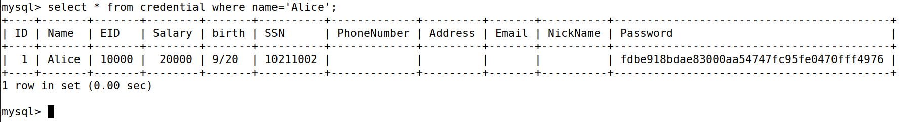
  Figure 1: Querying Alice's data in MySQL within the Docker container.

### 2. Attempt to attack the web application through the login portal
- **Process**: Injected the string `admin '#` into the username textfield.
- **Observation**: Second image shows a successful injection attack, (unfortunately) returning some data
  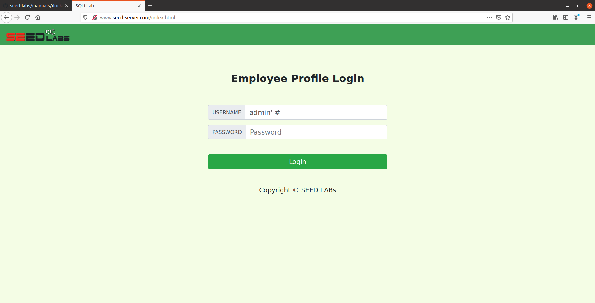
  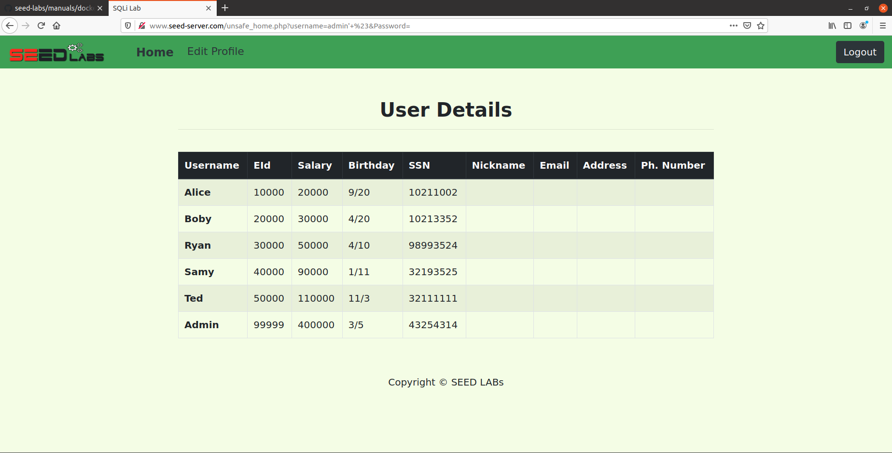

### 3. Attempt to attack the web application through command line
- **Process**: Injected the same string `admin '#` into a curl request. 
- The command used was the following: `curl ’www.seed-server.com/unsafe_home.php?username=admin '&Password=’`
- **Observation**: The command line spits out a (not so pretty) output of the table seen in the previous screenshot.
  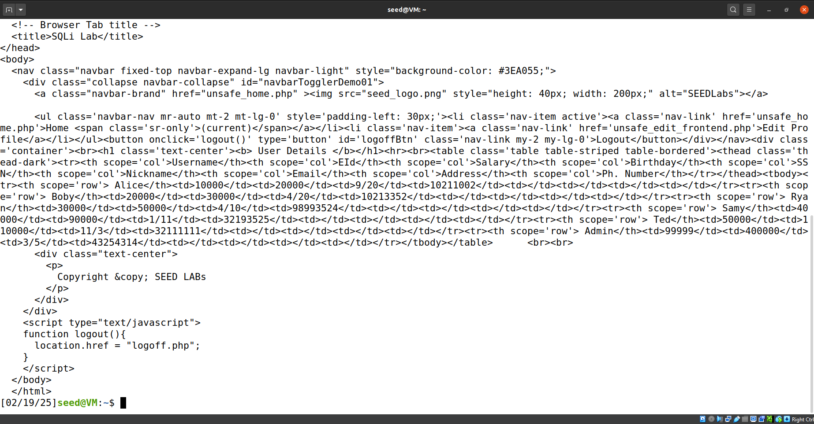

### 4. Attempt to execute multiple SQL statements in one attack
- **Observation**: No screenshot for this one, but research suggests that the countermeasure mentioned in the lab instructions (found below) are either prepared statements or parameterized queries. Looking into prepared statements more closely (and soon later in the lab), the main purpose of it is to split the process of executing queries into two parts: the first being to set up the query (hence the term "prepare"), and the second being to treat the input as data rather than code. This prevents malicious input from attackers from being executed.

### 5. Attempt to attack the web application using an UPDATE statement
- **Process**: Change Alice's salary to $30,000, up from $20,000.
- **Observation**: The comparison between the second and third screenshots show the appropriate change in salary value.
  - The attack string is as follows: `Alice', salary=30000 #`.
  - It is worth noting that the start of the string is not necessary, and only the substring starting from the single quote onwards is fine (and preferred). This is because everyone's nickname at the very start of the lab is empty, and putting something there will change the nickname as well as, in this case, the salary. Wouldn't want to make an injection attack obvious, would we?
  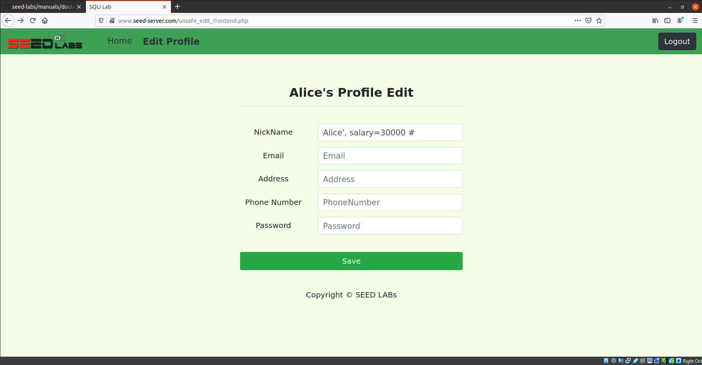
  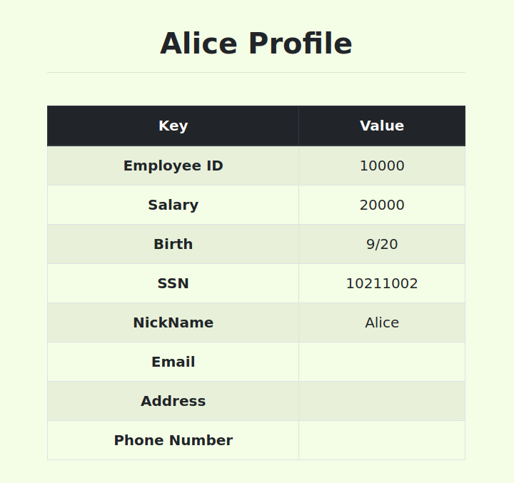
  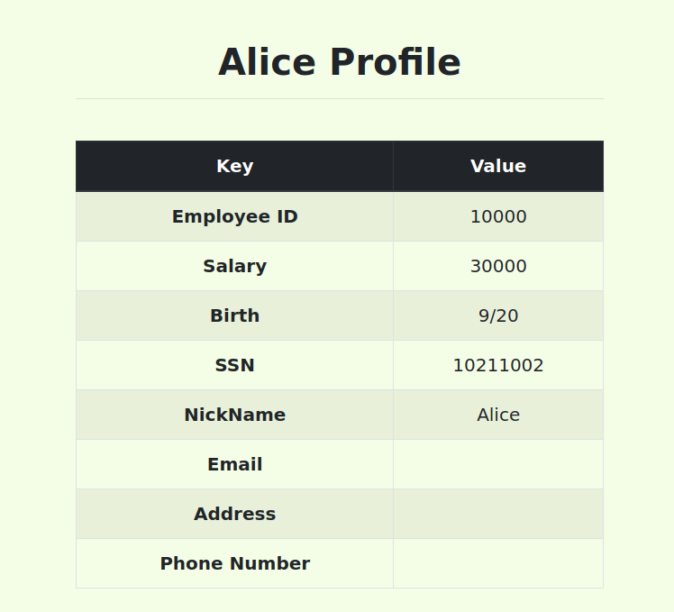

### 6. Attempt to attack the web application using an UPDATE statement (Part 2)
- **Process**: Update Boby's salary to $1, down from $30,000 (because Alice happens to be disgruntled from how her boss was acting towards her that one day or something).
- **Observation**: Utilizing the following attack string, the attack was successful: `', salary=1 where name='Boby'; #`
  - We can see the difference in salary taking place here, looking back at the second screenshot of section 2, where we successfully performed an SQL injection attack for the first time.
  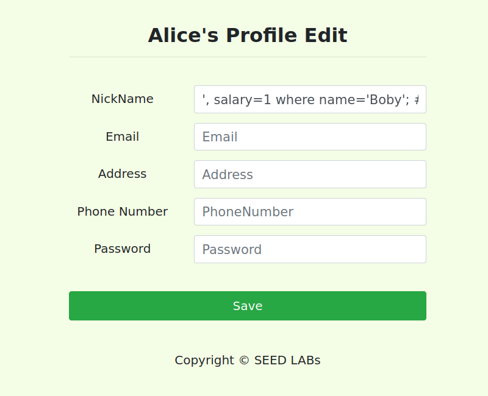
  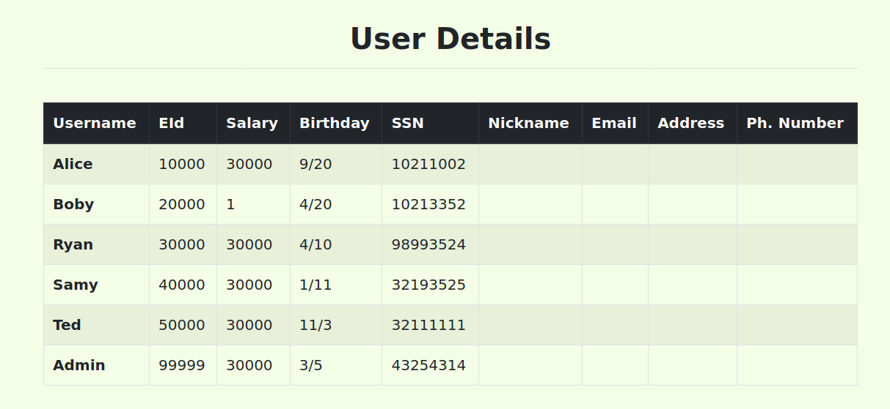

### 7. Changing Boby's Password
- **Process**: Update Boby's password to something we know to wreak even more havoc/chaos/whatever, because Alice is still disgruntled for some reason.
- **Observation**: The lab instructions say that the password hashing algorithm is SHA1. Knowing this, we can set Boby's password to anything we want, provided that we change the hashed password into a different hashed password that we know. In this case, we're going to change Boby's password to "badpassword".
- The attack string used for this step was the following: `', password='8a29aaf5687129c1d27b90578fc33ecc49d069dc' where name='Boby'; #`
  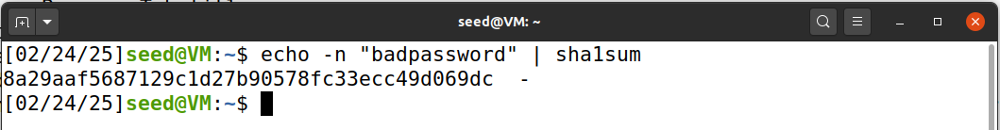
  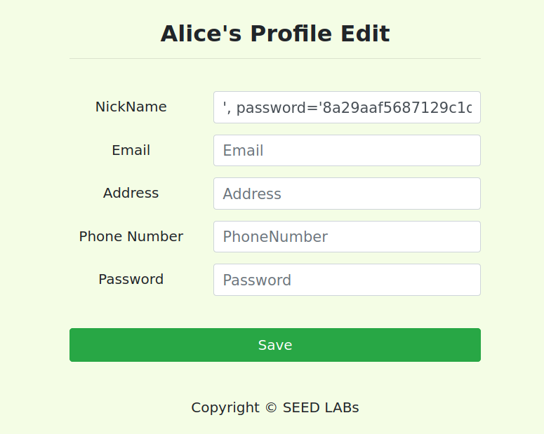
  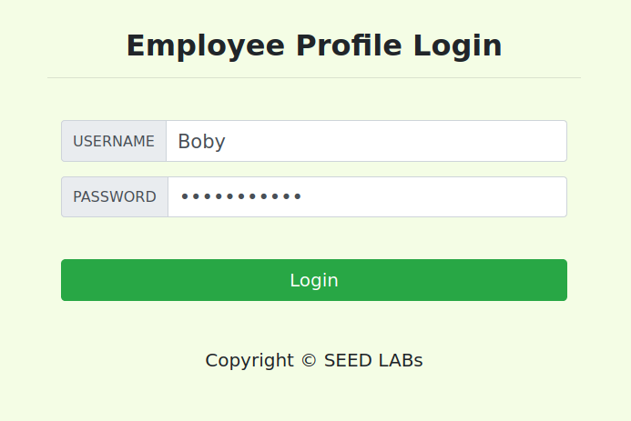
  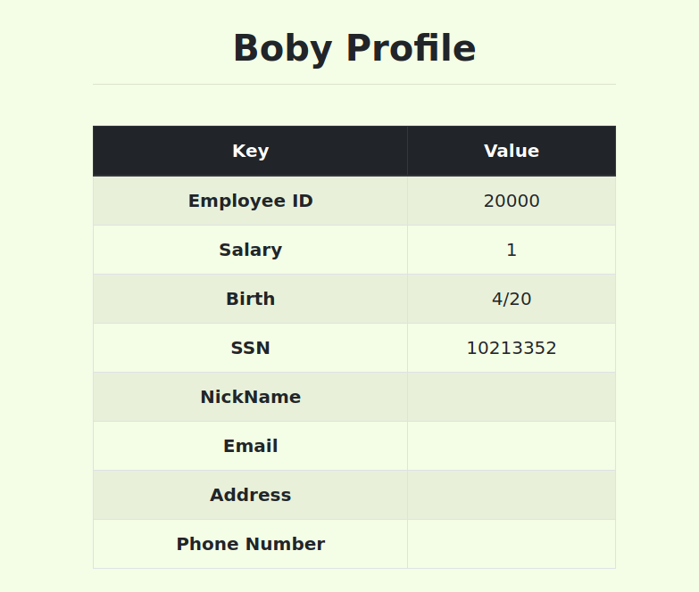

### 8. Countermeasures via. prepared statements and implementation
- **Process**: Implement a countermeasure to SQL injection attacks to prevent future injection attacks from taking place. We don't want disgruntled employees changing the database as they please anymore...
- **Observation**: Changing some code around and taking after their provided example, I implemented the following prepared statement in PHP. Rebuilding Docker was necessary to see any changes take place. Screenshots 2 and 3 show a successful SQL injection attack prior to the implementation, and the last screenshot shows an unsuccessful SQL injection attack after the change. However, it would probably be wise to implement a way to prevent the attacker from logging in at all...
  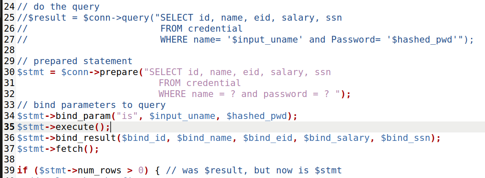
  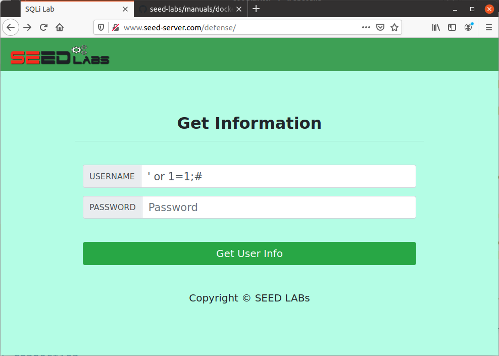
  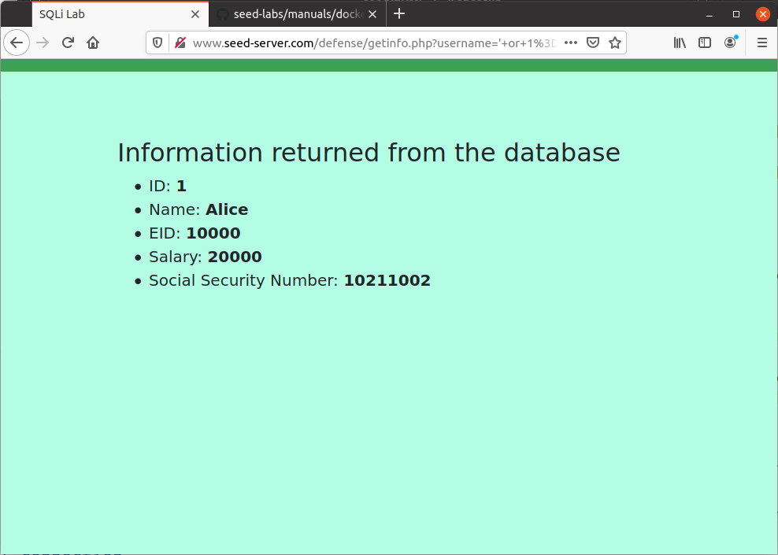
  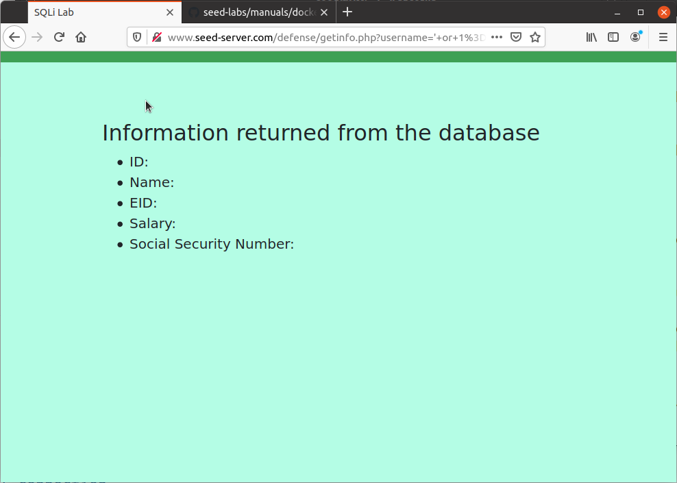

---

## Key Takeaways

- SQL injection remains one of the most critical vulnerabilities in web applications.
- **Exploitation**: SQL injection allows attackers to bypass authentication and extract sensitive data, often without detection.
- **Mitigation**: The implementation of prepared statements (and strong input validation + potentially a way for attackers to not get unauthorized access) significantly reduces the risk of SQL injection attacks.
- This lab emphasized the importance of secure coding practices and regular security assessments.

---

## Additional Notes

- The lab steps follow the structure presented in the [SEEDLabs SQL Injection PDF](https://seedsecuritylabs.org/Labs_20.04/Files/Web_SQL_Injection/Web_SQL_Injection.pdf).
- This lab was recreated from the original assignment included in this directory.
