# SQL Injection Lab

## Objective

This lab is designed to exploit SQL injection vulnerabilities in a web application, showcasing the common attack vectors, exploitation methods, and preventive measures to secure web applications.

---

## Environment Setup

- **Target**: Vulnerable web application provided by SEEDLabs via Docker
- **Tools Used**:
  - PHP
  - Firefox
  - Docker
  - MySQL
  - Oracle VM Virtualbox
  - SEEDLabs VM provided by SEEDLabs, located [here](https://seedsecuritylabs.org/labsetup.html).

---

## Steps and Key Findings

### 1. Details of Employee Alice
- **Process**: Utilize MySQL to show the data on Employee Alice
  

    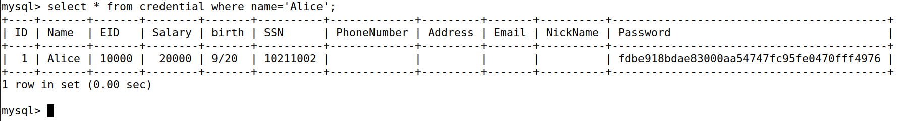
     
    <em>Figure 1: Querying Alice's data in MySQL within the Docker container.</em>
  

### 2. Attempt to attack the web application through the login portal
- **Process**: Injected the string `admin' #` into the username textfield.
- **Observation**: Second image shows a successful injection attack, (unfortunately) returning some data
  

    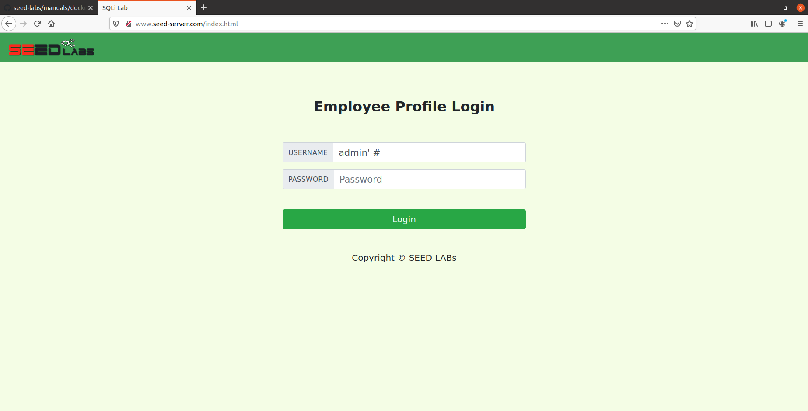
     
    <em>Figure 2: SQL Injection attempt to log into the admin account.</em>
  
  

  

    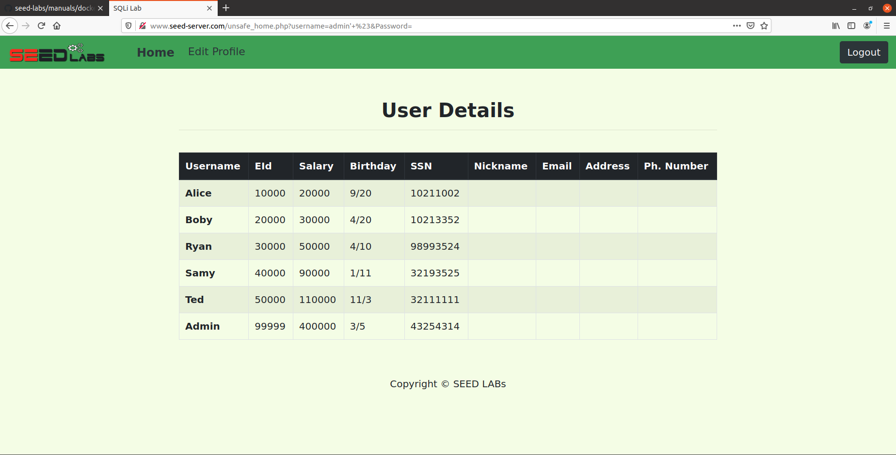
     
    <em>Figure 3: SQL Injection attempt was a success!</em>
  
    

### 3. Attempt to attack the web application through command line
- **Process**: Injected the same string `admin' #` into a curl request. 
- The command used was the following: `curl ’www.seed-server.com/unsafe_home.php?username=admin '&Password=’`
- **Observation**: The command line spits out a (not so pretty) output of the table seen in Figure 4.
  

    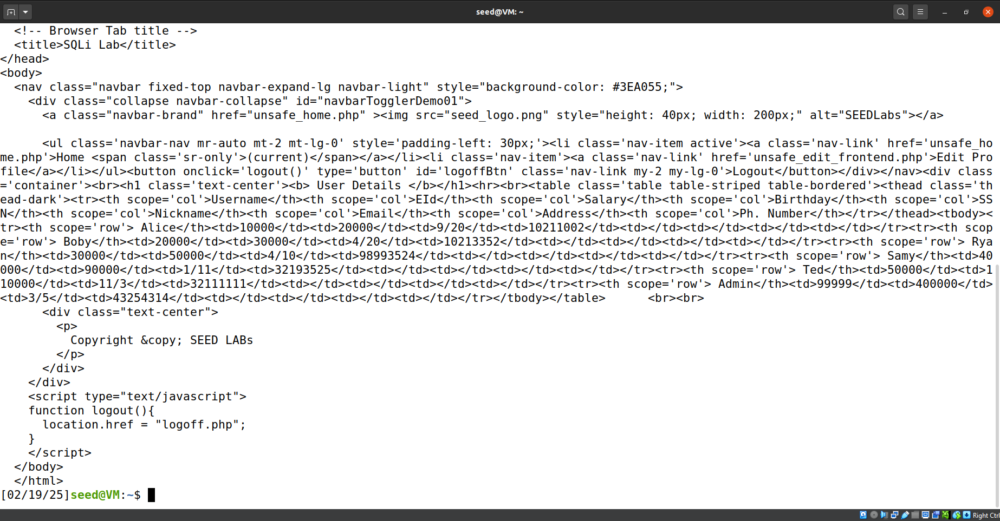
     
    <em>Figure 4: Performing the SQL Injection attack through the curl command. Not so pretty, but it works.</em>
  
    

### 4. Attempt to execute multiple SQL statements in one attack
- **Observation**: No screenshot for this one, but research suggests that the countermeasure mentioned in the lab instructions (found below) are either prepared statements or parameterized queries. Looking into prepared statements more closely (and soon later in the lab), the main purpose of it is to split the process of executing queries into two parts: the first being to set up the query (hence the term "prepare"), and the second being to treat the input as data rather than code. This prevents malicious input from attackers from being executed.

### 5. Attempt to attack the web application using an UPDATE statement
- **Process**: Change Alice's salary to $30,000, up from $20,000.
- **Observation**: The comparison between Figures 6 and 7 show the appropriate change in salary value.
  - The attack string is as follows: `Alice', salary=30000 #`.
  - It is worth noting that the start of the string is not necessary, and only the substring starting from the single quote onwards is fine (and preferred). This is because everyone's nickname at the very start of the lab is empty, and putting something there will change the nickname as well as, in this case, the salary. Wouldn't want to make an injection attack obvious, would we?
  

    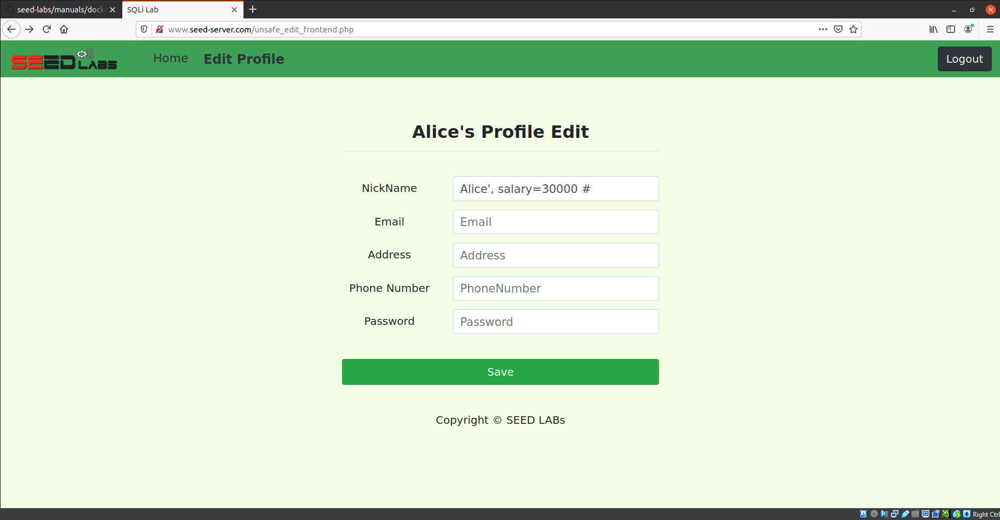
     
    <em>Figure 5: The attack string input in the nickname field when editing a profile.</em>
  
      

  

    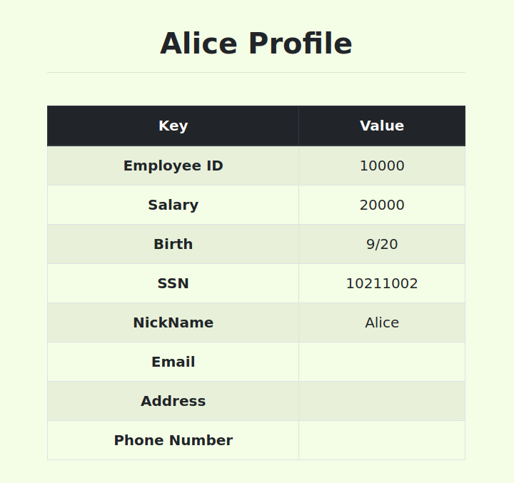
     
    <em>Figure 6: Before the attack took place. Notice that Alice's salary is still $20,000 here.</em>
  
    

  

    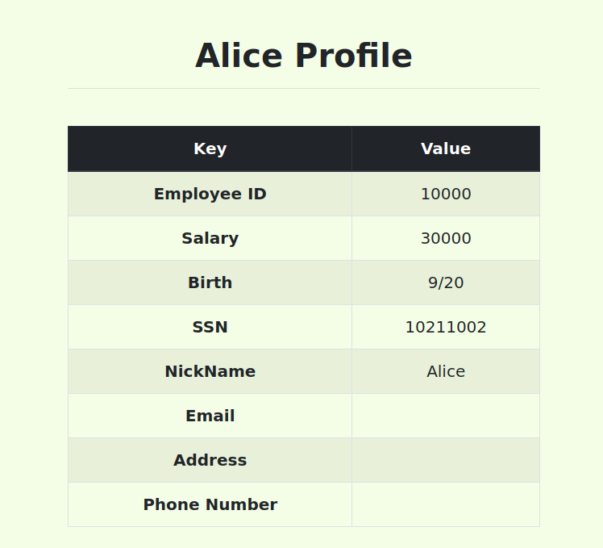
     
    <em>Figure 7: After the attack took place. Notice that Alice's salary is now $30,000.</em>
  
    

### 6. Attempt to attack the web application using an UPDATE statement (Part 2)
- **Process**: Update Boby's salary to $1, down from $30,000 (because Alice happens to be disgruntled from how her boss was acting towards her that one day or something).
- **Observation**: Utilizing the following attack string, the attack was successful: `', salary=1 where name='Boby'; #`
  - We can see the difference in salary taking place here, looking back at Figure 3, where we successfully performed an SQL injection attack for the first time.
 
  

    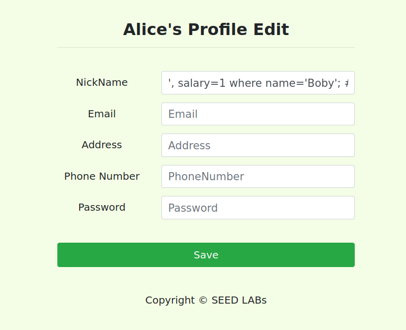
     
    <em>Figure 8: Before the attack on Boby took place.</em>
  
    

  

    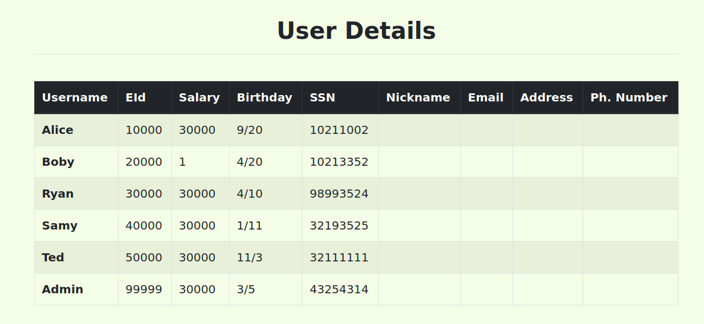
     
    <em>Figure 9: After the attack on Boby took place. Refer back to Figure 3, where we can see Boby's initial salary being $30,000, now reduced to a measly $1.</em>
  
    

### 7. Changing Boby's Password
- **Process**: Update Boby's password to something we know to wreak even more havoc/chaos/whatever, because Alice is still disgruntled for some reason.
- **Observation**: The lab instructions say that the password hashing algorithm is SHA1. Knowing this, we can set Boby's password to anything we want, provided that we change the hashed password into a different hashed password that we know. In this case, we're going to change Boby's password to "badpassword".
- The attack string used for this step was the following: `', password='8a29aaf5687129c1d27b90578fc33ecc49d069dc' where name='Boby'; #`
  

    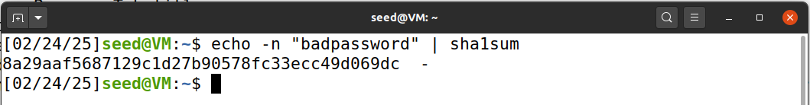
     
    <em>Figure 10: The SHA1 hash of "badpassword", which we will use as Boby's new password.</em>
  
      

  

    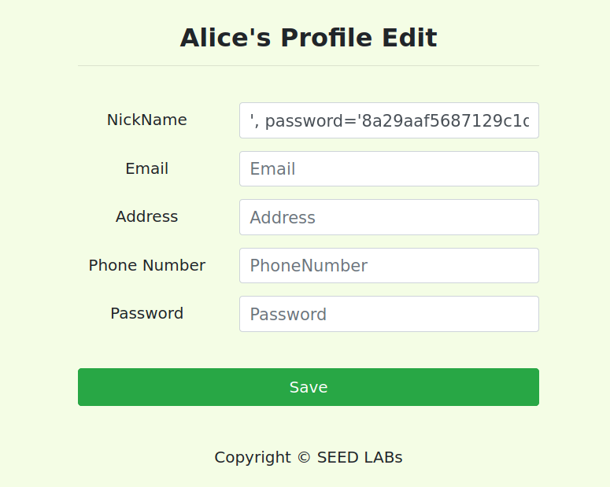
     
    <em>Figure 11: We use this SHA1 hash to overwrite whatever hashed password Boby has put in place. We are essentially storing this malicious password's hash ahead of time so when we type in "badpassword" as our password for Boby's account, the hashing algorithm will return this exact hash.</em>
  
      
  
  

    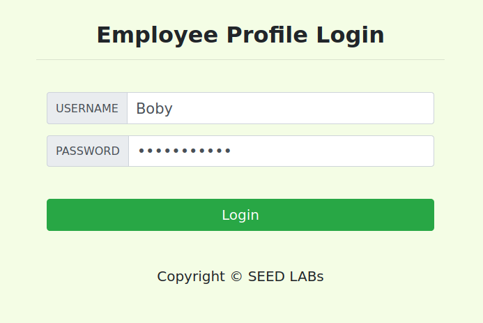
     
    <em>Figure 12: We attempt to log in as Boby with our new password "badpassword".</em>
  
    

  

    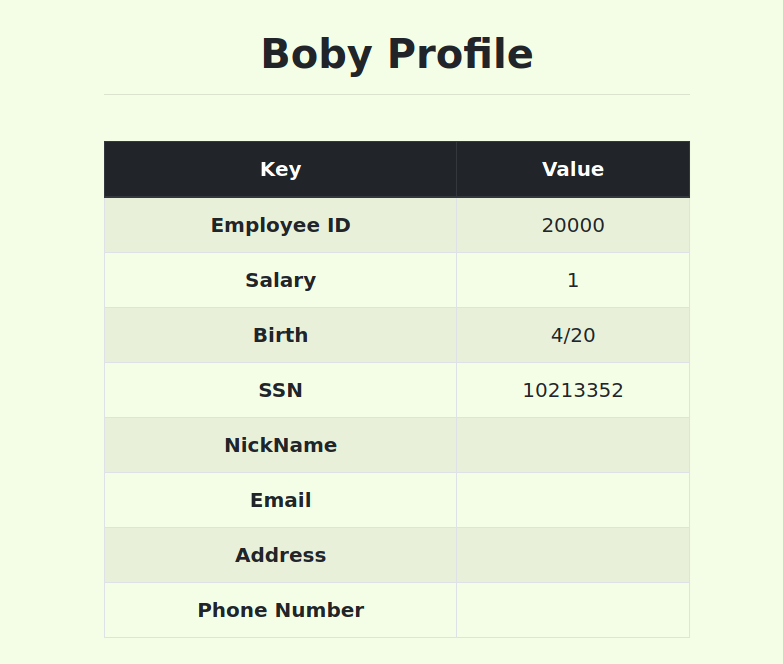
     
    <em>Figure 13: Login success!</em>
  
    

### 8. Countermeasures via. prepared statements and implementation
- **Process**: Implement a countermeasure to SQL injection attacks to prevent future injection attacks from taking place. We don't want disgruntled employees changing the database as they please anymore...
- **Observation**: Changing some code around and taking after their provided example, I implemented the following prepared statement in PHP. Rebuilding Docker was necessary to see any changes take place. Figures 15 and 16 show a successful SQL injection attack prior to the implementation, and Figure 17 shows an unsuccessful SQL injection attack after the change. However, it would probably be wise to implement a way to prevent the attacker from logging in at all...
  

    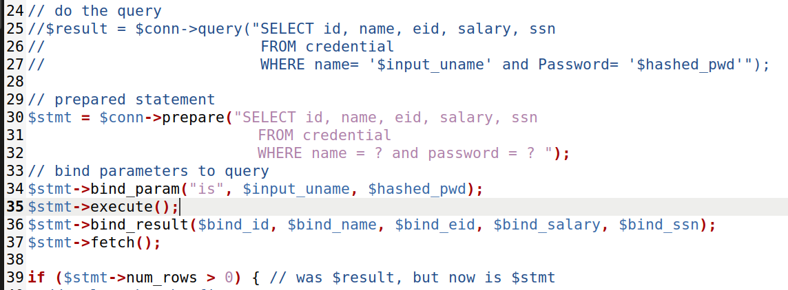
     
    <em>Figure 14: Implementing the prepared statement and commenting out the previous vulnerability.</em>
  
   

  

    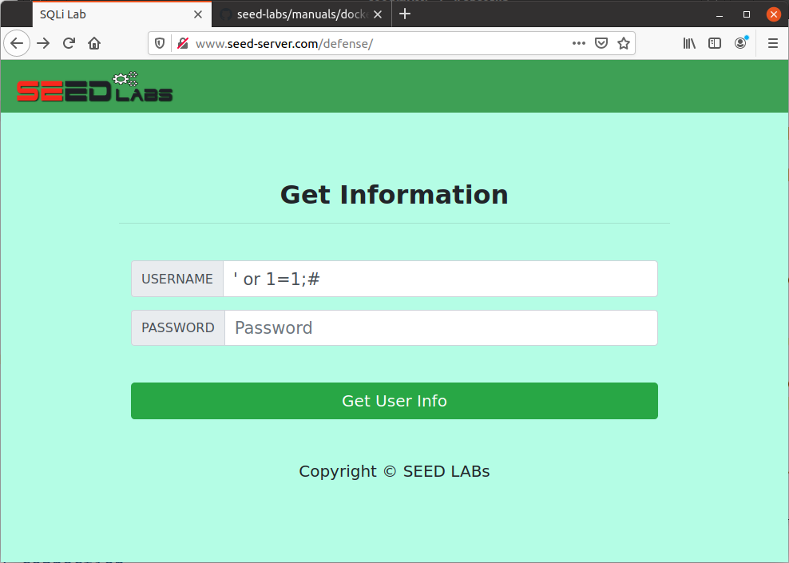
     
    <em>Figure 15: Showcasing SQL injection attack, starting from login screen.</em>
  
   

  

    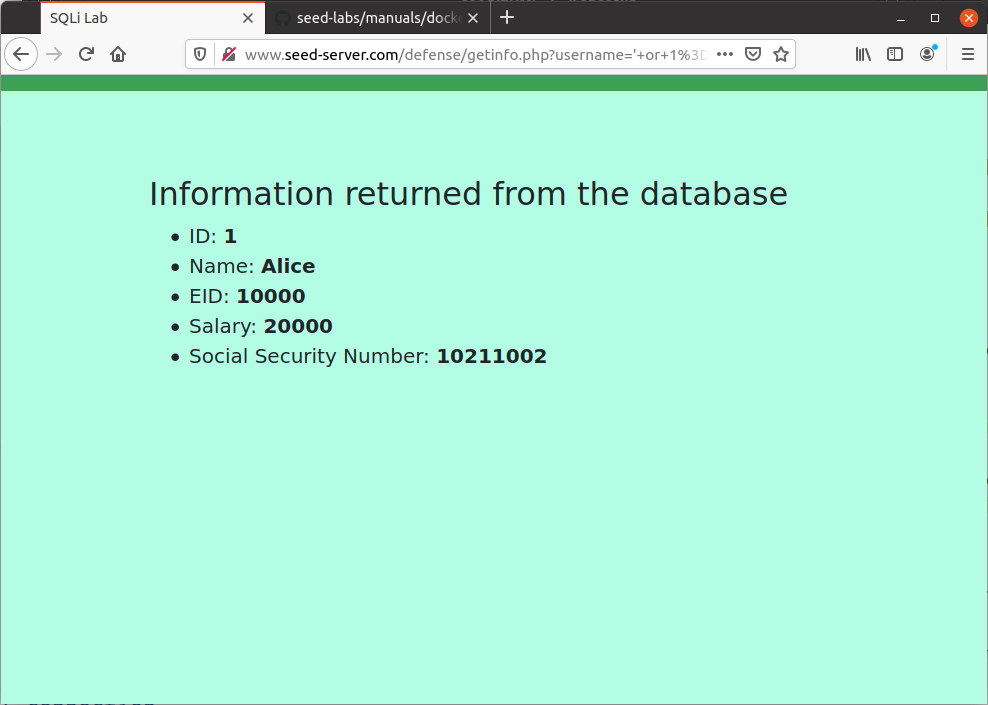
     
    <em>Figure 16: Showcasing SQL injection attack before prepared statement changes.</em>
  
   

  

    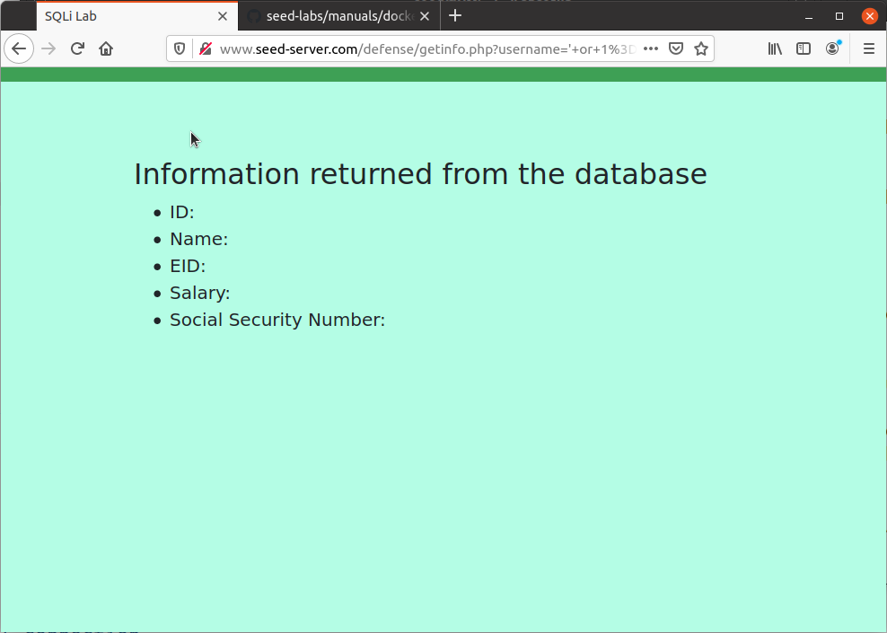
     
    <em>Figure 17: Showcasing SQL injection attack after prepared statement changes.</em>
  
   

---

## Key Takeaways

- **Critical Nature of SQL Injection**: SQL injection remains one of the most critical vulnerabilities in web applications, often serving as an entry point for attackers. This lab highlighted how easily an attacker can manipulate SQL queries to bypass authentication mechanisms, demonstrating why SQL injection continues to be a top threat in web security.

- **Exploitation via SQL Injection**: Through this lab, I learned how SQL injection allows attackers to manipulate backend databases by injecting malicious SQL statements. This can be used to bypass authentication, retrieve sensitive data, modify records, or even escalate privileges. The lab showed how such attacks can go undetected for long periods, as they exploit weaknesses in user input validation and query construction.

- **Mitigation through Prepared Statements**: The lab reinforced the importance of secure coding practices, particularly the use of prepared statements with parameterized queries. This technique prevents SQL injection by ensuring user inputs are treated as data, not executable code. This mitigation technique, along with strong input validation (e.g., filtering or sanitizing input), is a fundamental defense against SQL injection vulnerabilities.

- **Real-World Application of Defense Strategies**: By applying these mitigation strategies, I realized that proactive security measures are necessary in the development lifecycle. In addition to prepared statements, tools such as Web Application Firewalls (WAFs) and regular security assessments should be incorporated to protect against SQL injection attacks. The lab emphasized that even small oversights in handling user input can lead to significant vulnerabilities.

- **Exploiting Legacy Applications**: The lab also demonstrated how legacy applications that do not implement these secure coding practices are especially vulnerable to SQL injection. Many older web applications fail to sanitize user inputs properly, making them easy targets for SQL injection attacks. Understanding this reinforces the need for regular security assessments and updates to prevent exploitation of outdated systems.

- **Learning the Persistence of SQL Injection Attacks**: I also learned that SQL injection attacks are persistent and can lead to ongoing issues, as attackers can maintain unauthorized access or persistently exploit databases if proper countermeasures are not implemented. This highlights the importance of constant vigilance in web application security, even after initial exploits have been mitigated.
---

## Additional Notes

- The lab steps follow the structure presented in the [SEEDLabs SQL Injection PDF](https://seedsecuritylabs.org/Labs_20.04/Files/Web_SQL_Injection/Web_SQL_Injection.pdf). This is also included in this directory.
- This lab was recreated from the original assignment included in this directory.
