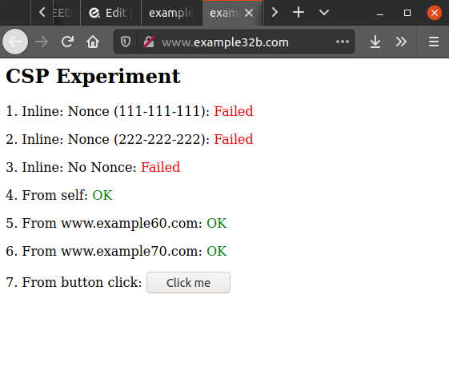

# XSS (Cross-site Scripting) Lab

## Objective

This lab demonstrates Cross‑Site Scripting (XSS) vulnerabilities by using a deliberately‑hardened (countermeasures commented out) Elgg social‑network web application. The goals are to (1) inject JavaScript into an Elgg profile to cause actions in other users’ browsers (alert & cookie disclosure), (2) exfiltrate session cookies to the attacker, (3) automate actions on victims’ behalf (forging requests to add a friend), and (4) design a self‑propagating XSS worm similar in concept to the Samy worm.

---

## Environment Setup

- **Target**: Vulnerable web application provided by SEEDLabs via Docker
- **Tools Used**:
  - PHP
  - JavaScript
  - Firefox
  - Docker
  - CSP
  - Oracle VM Virtualbox
  - SEEDLabs VM provided by SEEDLabs, located [here](https://seedsecuritylabs.org/labsetup.html).

### Side note
- I will avoid providing the full XSS scripts/code in this lab report, so as to not provide potentially dangerous code to be used maliciously in an unintended way. The screenshots provided will only show snippets of what I have added to the provided scripts/code in the lab.

---

## Steps and Key Findings

### 1. Posting a Malicious Message to Display an Alert Window
- **Process**: Embed a JavaScript program in one of the user profiles so when another user views the edited profile, the program executes and displays a simple message. 

  

    
     
    <em>Figure 1: A simple alert window executed when a user visits Alice's profile.</em>
  

### 2. Posting a Malicious Message to Display Cookies
- **Process**: Embed a JavaScript program in one of the user profiles so when another user views the edited profile, the program executes and displays the web page's cookie.

  

    
     
    <em>Figure 2: The victim's cookie in an alert window.</em>
  
  

### 3. Stealing Cookies from the Victim’s Machine
- **Process**: Implement a JavaScript program that sends the victim's cookies to the attacker.
- **Observation**: Send the victim’s cookies to the attacker’s server using a resource fetch (e.g., an injected `` tag).

  

    
     
    <em>Figure 3: Netcat command listening in on port 5555. The <code>-lknv</code> options are for allowing the attacker to listen for an incoming connection instead of initiating a connection to a remote host.</em>
  

  

    
     
    <em>Figure 4: The JavaScript code implemented in Alice's profile, censored for safety reasons.</em>
  

  

    
     
    <em>Figure 5: GET request exfiltrated from the victim when they loaded their own profile with the script in their profile from Figure 4.</em>
  

- **Observation**: The attacker receives the cookie string in plain text because the browser requested the image URL with the cookie appended. This demonstrates how XSS can be used to steal session tokens.       

### 4. Becoming the Victim’s Friend
- **Process**: Implement a script on Samy's profile to where if a different user visit Samy's profile, Samy is forcibly added as a friend.

  

    
     
    <em>Figure 6: We inspect the element of the Add Friend button. Where it is highlighted in blue, we can see a very important number next to <code>add?friend=</code>, being 59.</em>
  

  

    
     
    <em>Figure 7: Samy's profile with the malicious code, censored for safety reasons. The important thing to note is the number 59, indicating Samy's ID when selecting <code>Inspect Element</code> on Samy's Add Friend button in the previous screenshot.</em>
  

  

    
     
    <em>Figure 8: Alice's friend list prior to visiting Samy's profile.</em>
  

  

    
     
    <em>Figure 9: We see a console message in the inspect element window, indicating that the script works.</em>
  

  

    
     
    <em>Figure 10: Alice's friend list after visiting Samy's profile.</em>
  

- **Observation**: The JavaScript code executes as soon as a different user visit Samy's profile. When Samy visits his own profile, nothing will happen because you can't add yourself as a friend.

### 5. Modifying the Victim’s Profile
- **Process**: Implement JavaScript code where the victim's profile is modified upon visiting Samy's profile.
- **Observation**: Alice's profile gets modified successfully upon viewing Samy's profile.

  

    
     
    <em>Figure 11: This is the script used to implement changing the victim's profile upon visiting Samy's profile, censoring everything but the parts I added myself. Note the "You were infected!" string. Please note that <code>&briefdescription</code> becomes just <code>&description</code> to make the script affect the "About me" section rather than the "Brief Description" section, seen in later screenshots.</em>
  
      

  

    
     
    <em>Figure 12: Alice's profile before being infected by Samy's script in Figure 10.</em>
  

  

    
     
    <em>Figure 13: Upon visiting Samy's profile, we can confirm that the script executed properly (it's not actually a self-propagating worm yet).</em>
  
       

  

    
     
    <em>Figure 14: Alice's profile after visiting Samy's profile. The brief description of Alice's profile was modified, indicating that the script works.</em>
  
    

### 6. Writing a Self-Propagating XSS Worm
- **Process**: Implement a script on Samy's profile where the script self-propagates, turning victims into attackers.
- **Observation**: Notice how Alice's profile changes, followed by Boby's profile when he visits Alice after she gets infected with the worm.
 
  

    
     
    <em>Figure 15: This is Alice's profile, just as how we left it in Figure 12 except for the fact that I moved the "You were infected!" message to the "About me" section. This was where I tested changing <code>&briefdescription</code> to just <code>&description</code> in the script earlier.</em>
  
    

  

    
     
    <em>Figure 16: Upon inspecting element and navigating to the console, we can see a confirmation of the script working via the output.</em>
  

  

    
     
    <em>Figure 17: Upon returning to Alice's profile, the message "You were infected!" is gone. This confirms that the script definitely did something.</em>
  

  

    
     
    <em>Figure 18: This is the script that transferred itself into Alice's profile, censored for safety reasons. This was done by simply replacing the "You were infected!" string with the actual self-propagating mechanism scribbled in red.</em>
  
 

- **Observation**: So we know that Samy's script worked on Alice when she visited his profile. Do we know if it can self-propagate if a different user visits Alice's profile instead of Samy's? Let's see how Boby handles this.

  

    
     
    <em>Figure 19: This is Boby's profile before he visits Alice's infected profile. It's currently clean and uninfected.</em>
  
 

  

    
     
    <em>Figure 20: Checking the console, we can see that we get confirmation that the script works once again, only that we're visiting Alice's profile instead of Samy's profile this time.</em>
  
 

  

    
     
    <em>Figure 21: As expected, Boby's profile how shows an empty "About me" section, indicating that the script has done something.</em>
  
 

  

    
     
    <em>Figure 22: Boby's profile infected with the worm that cloned itself from Alice. The script is censored for safety reasons.</em>
  
 

### 7. Defeating XSS Attacks Using CSP (Countermeasure)
- **Process**: To defend against XSS attacks, we have to separate code from data. XSS is a vulnerability that takes advantage of data being processed alongside code. We demonstrate the countermeasure through utilizing CSP (Content Security Policy) in provided websites by SEEDLabs.
    
    - We also modify a .php file and an apache.config file within the following screenshots.

  

    
     
    <em>Figure 23: The first website, example32a. The "OK"s mean that the JavaScript code associated with that numbered line is executing successfully.</em>
  
      

  

    
     
    <em>Figure 24: This is what happens when we click the button on example32a. The same will happen for example60 and example70, although those won't be shown.</em>
  
      
  
  

    
     
    <em>Figure 25: The second website, example32b. Notice that there are now some lines that say "Failed". This is because of CSP being implemented for some of them, specifically where they are failing. This can also be observed in the following websites. The button does not do anything.</em>
  
    

  

    
     
    <em>Figure 26: The third website, example23c. The first line is marked "OK", unlike with example32b.</em>
  

- **Observation**: The lab asks us to modify both the .php and the apache.config files to implement CSP appropriately. Let's do that now.

  

    
     
    <em>Figure 27: The apache.config file. The lab wants us to modify this file in a way where example32b displays "OK" for both example60 and example70. The example70.com line was already marked as "OK", so that just leaves example60 to be changed. Here, we simply add that to where it defines CSP for example32b. Originally, only example70 was listed, but we added example60 alongside it.</em>
  

  

    
     
    <em>Figure 28: Lines 5 and 6 now say "OK", signifying that the JavaScript code can now execute for those tests.</em>
  
    
  
  

    
     
    <em>Figure 29: The phpindex.php file containing the CSP definition. The lab wants us to have everything but line 3 to say "OK". We added the line inbetween 4 and 5 to make that happen.</em>
  
  

  

    
     
    <em>Figure 30: All lines but number 3 now say "OK", signifying that the JavaScript code can now execute for those tests.</em>
  
      
    
---

## Key Takeaways
- **Critical Nature of Cross-Site Scripting (XSS)**: XSS is a common and powerful web vulnerability that lets an attacker execute arbitrary JavaScript in another user’s browser. The lab demonstrates that, when application defenses are disabled, even small input fields (e.g., an Elgg profile brief description) can become an entry point for injected scripts that run in the security context of authenticated users.

- **Practical Mechanics of Script‑Based Exploits**: By embedding JavaScript into profile fields, the exercises show how injected code can immediately read `document.cookie`, manipulate the DOM, or load remote scripts — illustrating that tiny snippets of JS can expose session tokens and enable further actions from the victim’s browser.

- **Simple but Effective Exfiltration Techniques**: The lab demonstrates how injected code can exfiltrate sensitive data (like session cookies) using straightforward browser behavior — for example, creating an `` tag whose `src` points to an attacker listener. Using `nc` as a listener during the exercises clearly illustrates how easily cookie strings or other data can be siphoned off when protections are absent.

- **Forged Requests and the Importance of CSRF Protections**: Task 4 shows how an attacker’s script can forge the exact GET/POST requests that a legitimate user’s browser would make (including using tokens present in `elgg.security.token`) so long as the endpoint lacks proper request validation. This demonstrates why state‑changing endpoints require verified CSRF tokens and strict server‑side validation — otherwise the victim’s browser can be weaponized to change server state (add friends, edit profiles).

- **XSS Worms & Self‑Propagation Risk**: Building on forging requests, the lab reproduces a Samy‑like worm pattern: a payload that both performs an action (e.g., add attacker as friend) and writes itself into the victim’s profile so future visitors become infected. This shows how stored XSS can lead to rapid, large‑scale compromise within a social app if writeable content is not properly sanitized.

- **Layered Mitigations are Necessary and Practical**: The lab explicitly covers countermeasures such as output encoding/sanitization, using HttpOnly for session cookies (to block `document.cookie` access), deploying Content Security Policy (CSP) to limit script sources and inline execution, and enforcing server‑side CSRF tokens. Practically combining these defenses was shown to substantially reduce the attack surface in the exercises.

- **Operational and Legacy System Lessons**: The exercises highlight that legacy or misconfigured deployments (where XSS countermeasures are disabled or absent) are especially dangerous. Persistent infections and worm‑like propagation are realistic threats in outdated systems, underlining the need for routine audits, secure defaults, and prompt remediation in production environments.

---

## Additional Notes

- The lab steps follow the structure presented in the [SEEDLabs XSS PDF](https://seedsecuritylabs.org/Labs_20.04/Files/Web_XSS_Elgg/Web_XSS_Elgg.pdf). This is also included in this directory.
- This lab was recreated from the original assignment included in this directory.
